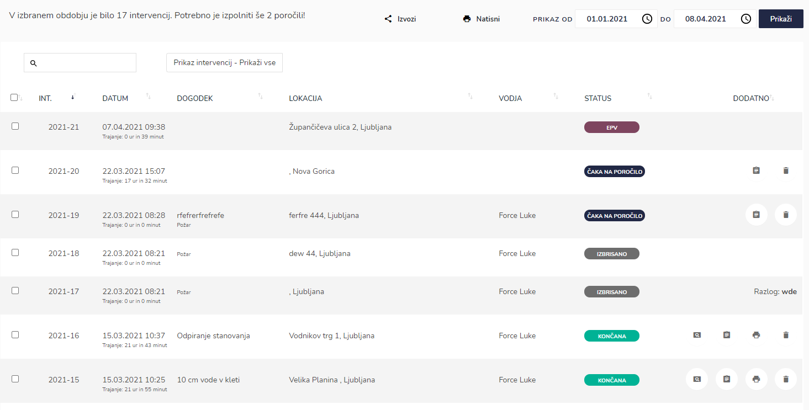
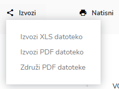

# Arhiv intervencij

S klikom na ikono za arhiv intervencij, dostopate do seznama aktivnih in zaključenih intervencij.

V tabeli lahko za vsako intervencijo izberete (v odvisnosti od pravic in statusa intervencije):

* v primeru dogodka večjega obsega lahko intervencijo pošljete v EPV modul
* ogled naloženih datotek (slik)
* urejanje poročila
* PDF poročila
* izbris intervencije

Imate tudi možnost dostopa do arhiva intervencij EPV.

Seznam intervencij lahko izvozite (kot XLS ali PDF datoteko) ali ga natisnete. Z gumbom "Združi PDF datoteke" lahko združite izpolnjena poročila v en PDF in jih natisnete vse naenkrat.

Izberete lahko za katero obdobje se v tabeli prikažejo intervencije.

