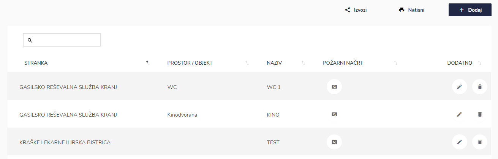
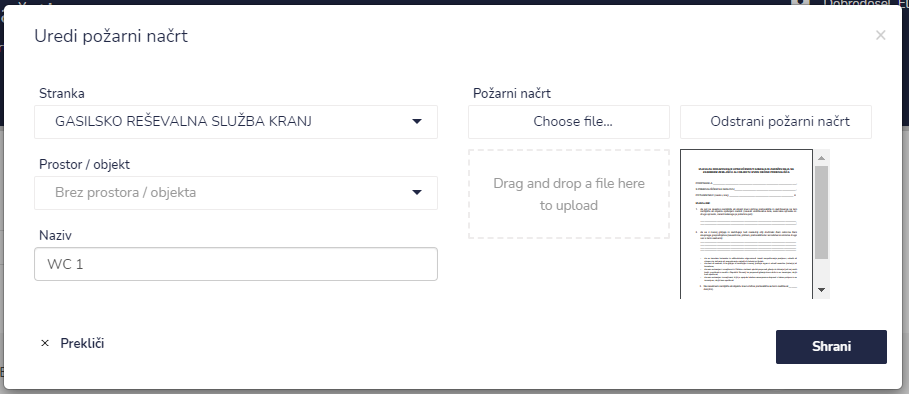
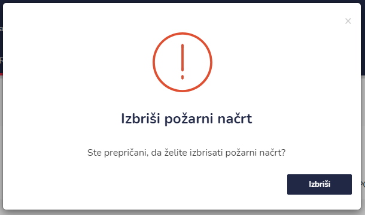

# Požarni načrti


[uporaba-tabel-iskanje-sortiranje-izvozi-tiskanje.md](../ostalo/uporaba-tabel-iskanje-sortiranje-izvozi-tiskanje.md)





| Ime polja            | Opis polja                                                  |
| -------------------- | ----------------------------------------------------------- |
| **Stranka**          | S pomočjo spustnega izberite stranko.                       |
| **Prostor / objekt** | S pomočjo spustnega koledarja izberite prostor oz. objekt.  |
| **Naziv**            | Dodajte ime požarnega načrta.                               |
| **Požarni načrt**    | Dodajte datoteko.                                           |


Požarni načrt lahko dodate tudi v profilu stranke.



[pozarni-nacrti.md](../stranke/pozarni-nacrti.md)








