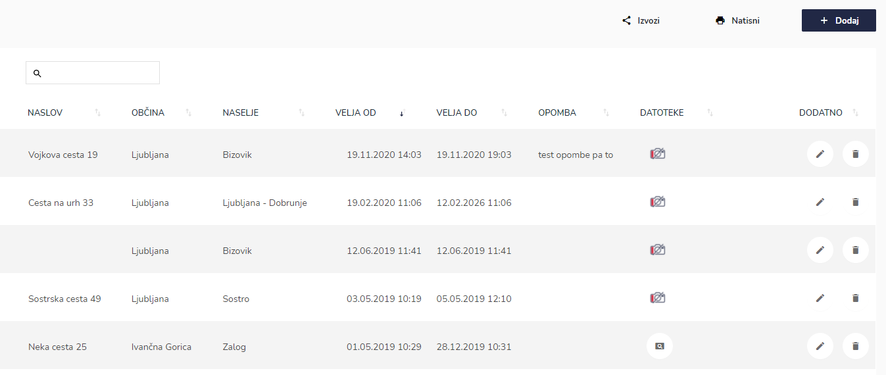
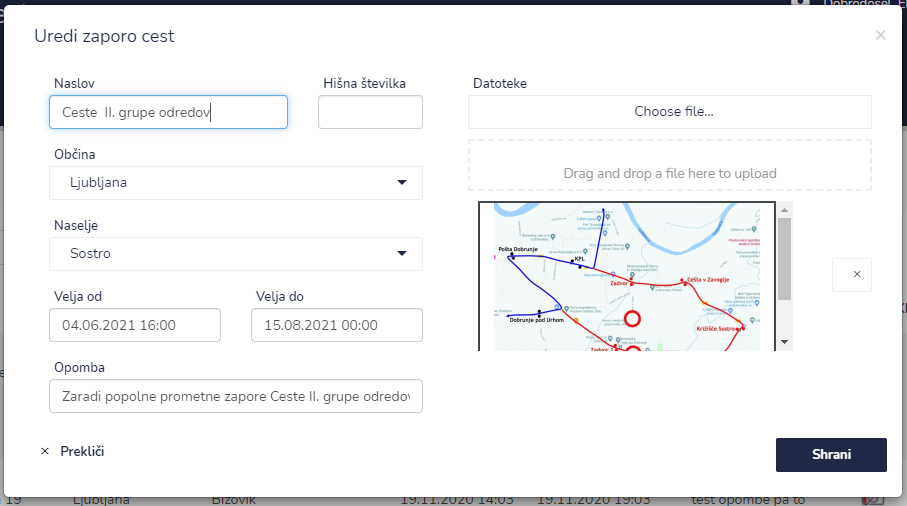
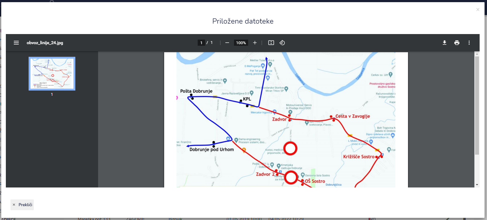

# Zapora cest


[uporaba-tabel-iskanje-sortiranje-izvozi-tiskanje.md](../ostalo/uporaba-tabel-iskanje-sortiranje-izvozi-tiskanje.md)





| Ime polja            | Opis polja                                                  |
| -------------------- | ----------------------------------------------------------- |
| **Naslov**           | Napišite naslov cestne zapore.                              |
| **Hišna številka**   | Vpišite hišno številko.                                     |
| **Občina**           | S pomočjo spustnega seznama izberite občino.                |
| **Naselje**          | S pomočjo spustnega seznama izberite naselje.               |
| **Velja od**         | Vpišite datum začetka zapore ceste.                         |
| **Velja do**         | Vpišite datum zaključek zapore ceste.                       |
| **Prostor / objekt** | S pomočjo spustnega koledarja izberite prostor oz. objekt.  |
| **Opomba**           | Dopišite opombe.                                            |
| **Datoteke**         | Dodajte PDF datoteko.                                       |







## Pregledovanje datotek pri zapori cest

odpre priložena datoteka

