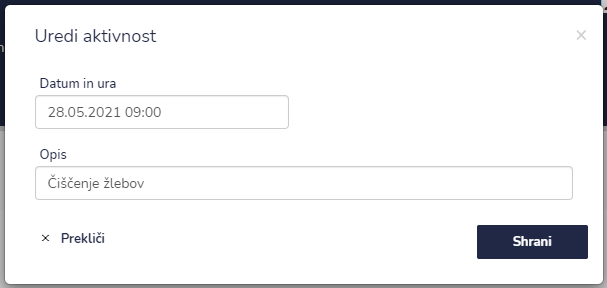

# Arhiv aktivnosti


[uporaba-tabel-iskanje-sortiranje-izvozi-tiskanje.md](../../ostalo/uporaba-tabel-iskanje-sortiranje-izvozi-tiskanje.md)





| Ime polja        | Opis polja                                               |
| ---------------- | -------------------------------------------------------- |
| **Datum in ura** | Iz spustnega koledarja izberite datum in uro aktivnosti. |
| **Opis**         | Napišite opis aktivnosti.                                |







