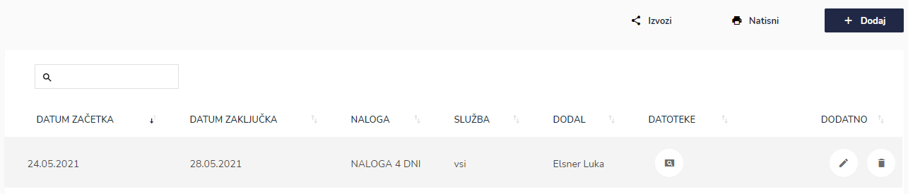
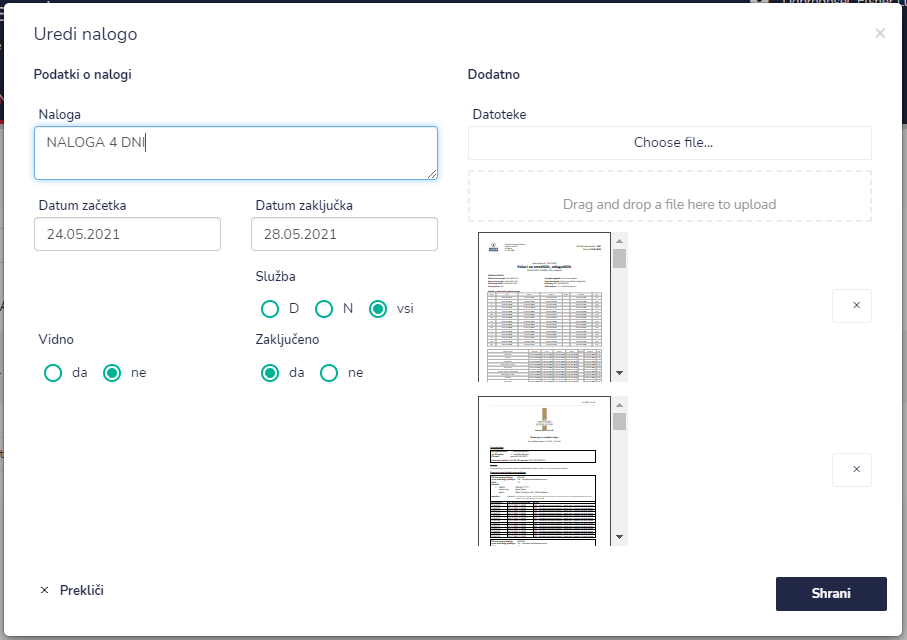
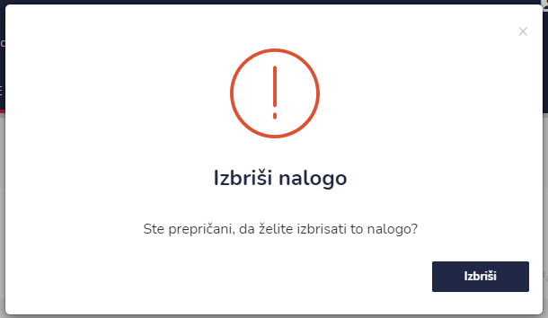

# Napovedane dnevne naloge


[uporaba-tabel-iskanje-sortiranje-izvozi-tiskanje.md](../../ostalo/uporaba-tabel-iskanje-sortiranje-izvozi-tiskanje.md)





| Ime polja              | Opis polja                                                                                                                                     |
| ---------------------- | ---------------------------------------------------------------------------------------------------------------------------------------------- |
| **Naloga**             | Napišire podatke o nalogi.                                                                                                                     |
| **Datum začetka**      | S pomočjo spustnega koledarja izberite dan in uro nalogo.                                                                                      |
| **Datum zaključka**    | S pomočjo spustnega koledarja izberite dan in uro naloge.                                                                                      |
| **Perioda ponavljana** | Iz spustnega seznama izberite periodiko ponavljanja. Naloga se lahko ne ponavlja,  lahko pa se ponavlja na 4 dni, tedensko, mesečno ali letno. |
| **Služba**             | Označite katera služba izvaja nalogo (D - dnevna, N - nočna ali Vsi).                                                                          |
| **Vidno**              | Označite ali naloga vidna ali ne.                                                                                                              |
| **Zaključeno**         | Označite ali je naloga zaključena ali ne.                                                                                                      |
| **Datoteka**           | Tu imate možnost, da dodate datoteke, ki so povezane z nalogo (doc, pdf, slike,...).                                                           |







