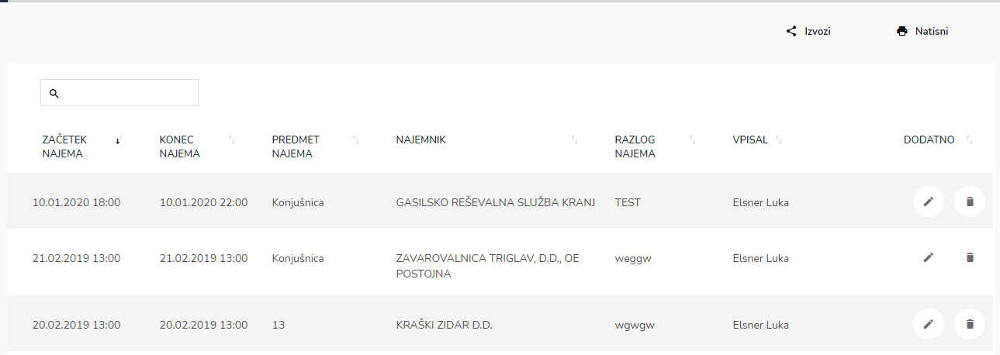
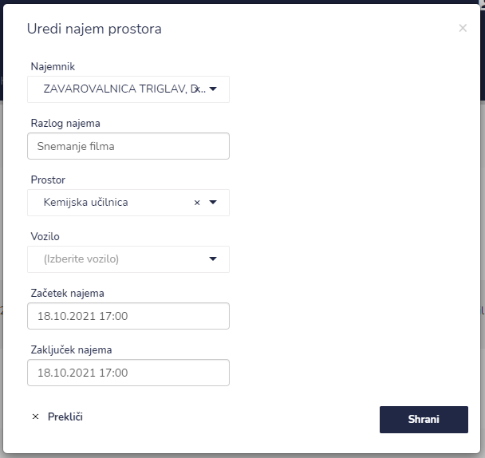

# Arhiv najemov




| Ime polja            | Opis polja                                                |
| -------------------- | --------------------------------------------------------- |
| **Najemnik**         | Iz spustnega seznama izberite stranko.                    |
| **Razlog najema**    | Napišite razlog najema.                                   |
| **Prostor**          | Iz spustnega seznama izberite prostor najema.             |
| **Vozilo**           | Iz spustnega seznama izberite vozilo.                     |
| **Začetek najema**   | S pomočjo spustnega koledarja izberite dan in uro najema. |
| **Zaključek najema** | S pomočjo spustnega koledarja izberite dan in uro najema. |







###

