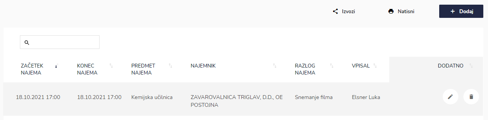
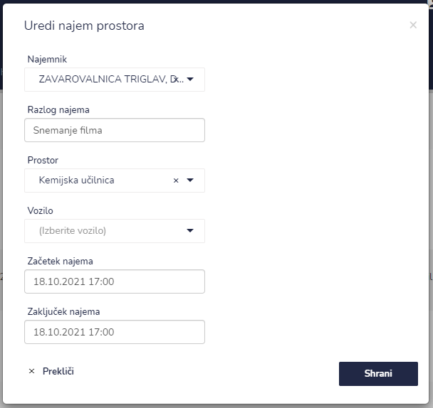
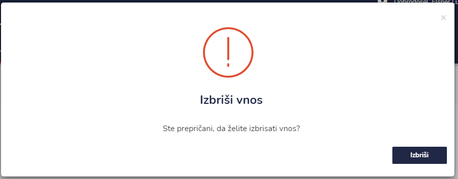

# Napovedani najemi


[uporaba-tabel-iskanje-sortiranje-izvozi-tiskanje.md](../../ostalo/uporaba-tabel-iskanje-sortiranje-izvozi-tiskanje.md)





| Ime polja            | Opis polja                                                |
| -------------------- | --------------------------------------------------------- |
| **Najemnik**         | Iz spustnega seznama izberite stranko.                    |
| **Razlog najema**    | Napišite razlog najema.                                   |
| **Prostor**          | Iz spustnega seznama izberite prostor najema.             |
| **Vozilo**           | Iz spustnega seznama izberite vozilo.                     |
| **Začetek najema**   | S pomočjo spustnega koledarja izberite dan in uro najema. |
| **Zaključek najema** | S pomočjo spustnega koledarja izberite dan in uro najema. |








### Kako dodati nov prostor za najem?

To naredite v NASTAVITVE > Enota > PROSTORI ZA NAJEM



[prostori-za-najem.md](../../nastavitve/enota/prostori-za-najem.md)


