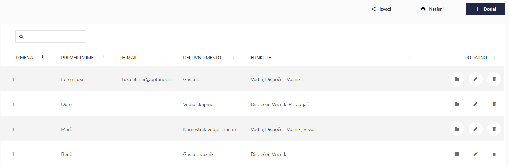
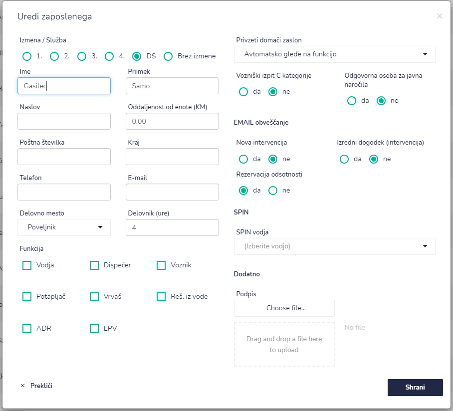
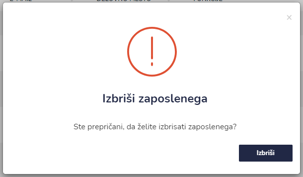

# Aktivni


[uporaba-tabel-iskanje-sortiranje-izvozi-tiskanje.md](../../ostalo/uporaba-tabel-iskanje-sortiranje-izvozi-tiskanje.md)





| Ime polja                             | Opis polja                                                                                                                                                      |
| ------------------------------------- | --------------------------------------------------------------------------------------------------------------------------------------------------------------- |
| **Izmena / Služba**                   | Označite polje.                                                                                                                                                 |
| **Ime**                               | Vpišite ime zaposlenega.                                                                                                                                        |
| **Priimek**                           | Vpišite priimek zaposlenega.                                                                                                                                    |
| **Naslov**                            | Vpišite naslov zaposlenega.                                                                                                                                     |
| **Oddaljenost od enote (KM)**         | Vpiši oddaljenost zaposelnega od enote v kilometrih (km).                                                                                                       |
| **Poštna številka**                   | Vpišite poštno številko.                                                                                                                                        |
| **Kraj**                              | Vpišite ime kraja.                                                                                                                                              |
| **Telefon**                           | Vpišite telefonsko številko zaposlenega.                                                                                                                        |
| **E-mail**                            | Vpišite e-mail naslov.                                                                                                                                          |
| **Delovno mesto**                     | Iz spustnega seznama izberite delovno mesto.                                                                                                                    |
| **Delovnik (ure)**                    | V pišite dolžino delovnika (8, 12 ur,...)                                                                                                                       |
| **Funkcija**                          | Izbirate lahko med več funkcijami (vodja, despečar, voznik, potapljač, vrvaš, reševalec iz vode, ADR ali EPV).                                                  |
| **Privzet domači zaslon**             | Iz spustnega seznama izberite kakšen bo domači zaslon zaposlenega ob prijavi v IGNIS.                                                                           |
| **Vozniški izpit C kategorije**       | Označite ali ima zaposleni vozniški izpit kategorije C.                                                                                                         |
| **Odgovorna oseba za javna naročila** | Označite ali je zaposlena odgovorna za javna naročila.                                                                                                          |
| **EMAIL obveščanje**                  | 
Označite ali bo zaposlen prejemal obvestila o:
<ul><li>novi intervenciji</li><li>izrednem dogodku (intervencija)</li><li>rezervacijo odsotnosti</li></ul> |
| **SPIN**                              | Iz spustnega seznama izberite SPIN vodjo.                                                                                                                       |
| **Dodatno**                           | Dodate lahko še podpis zaposlenega.                                                                                                                             |








.PNG>)




###

