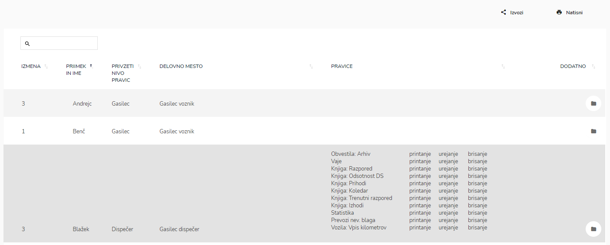

# Izpis pravic


[uporaba-tabel-iskanje-sortiranje-izvozi-tiskanje.md](../../ostalo/uporaba-tabel-iskanje-sortiranje-izvozi-tiskanje.md)


### Urejanje pravic zaposlenim

Z vpisom imena in priimka v iskalnik, poiščite zaposlenega.

se odpre profil zaposlenega, kjer pregledujete in urejate pravice zaposlenega.


Več informacij glede pravic dostopnih v profilu uporabnika

[**POVEZAVA**](https://navodila.ignis112.si/glava-hitri-gumbi/profil-uporabnika#pravice)



[profil-uporabnika.md](../../glava-hitri-gumbi/profil-uporabnika.md)


