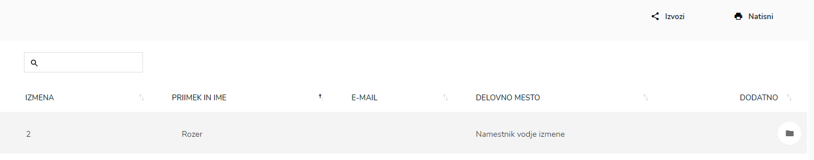
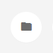
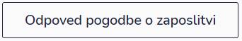
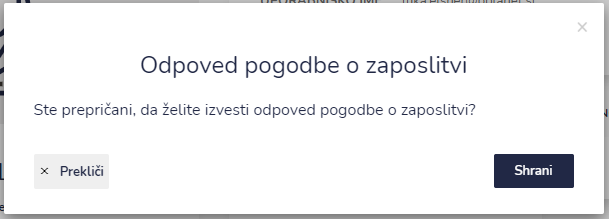
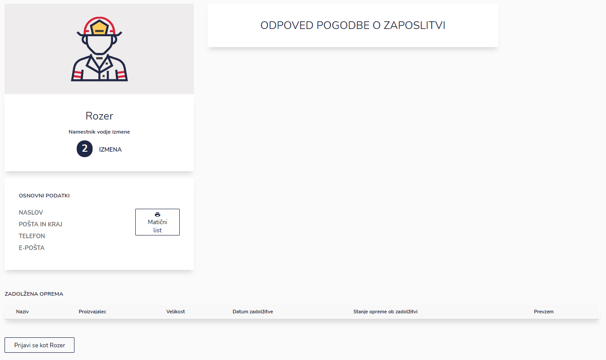

# Odpuščeni


[uporaba-tabel-iskanje-sortiranje-izvozi-tiskanje.md](../../ostalo/uporaba-tabel-iskanje-sortiranje-izvozi-tiskanje.md)


### Sprememba status iz zaposlenega v odpuščen

Pri izbranemu zaposlenemu odprite profil zaposlenega.&#x20;

.PNG>)

S klikom na ''Odpoved pogodbe o zaposlitvi'' (spodaj levo)

po potrditvi **Shrani** zaposleni dobi status ODPOVED POGODBE O ZAPOSLITVI.

