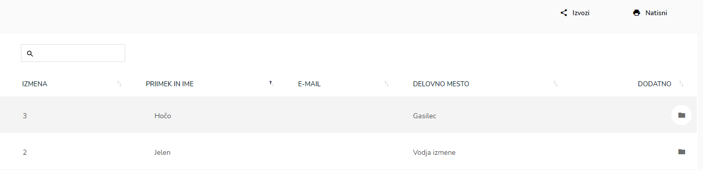
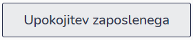
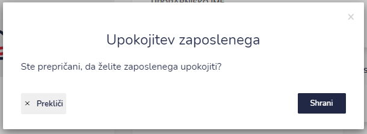

# Upokojenci


[uporaba-tabel-iskanje-sortiranje-izvozi-tiskanje.md](../../ostalo/uporaba-tabel-iskanje-sortiranje-izvozi-tiskanje.md)


### Menjava statusa iz zaposlenega v upokojenec

Pri izbranemu zaposlenemu odprite profil zaposlenega.

.PNG>)

S klikom na ikono ''Upokojitev zaposlenega''(spodaj levo)

po potrditvi **Shrani** zaposleni dobi status UPOKOJENEC.

.PNG>)
