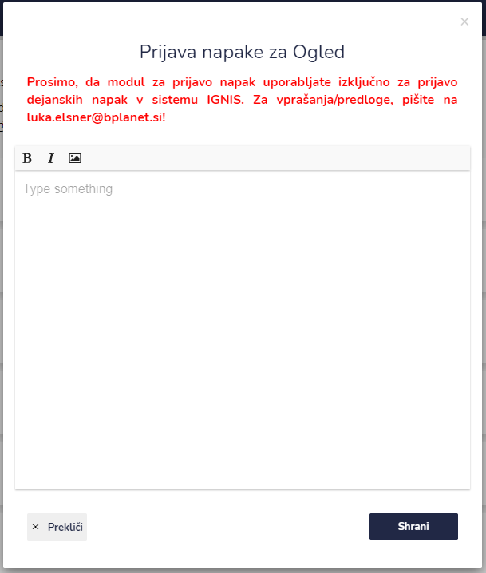

# Prijavi napako

Če naletite na napako v sistemu IGNIS jo lahko prijavite s klikom na ikono za prijavo napake.

Pri opisu napake bodite natančni:

* podroben opis napake
* kako ste do napake prišli
* če je napaka na primer pri intervencijah, povejte pri kateri intervenciji je težava ali če je napaka na primer pri vozilih, povejte pri katerem vozilu je težava itd.
* kateri brskalnik uporabljate in katero napravo (firefox, chrome, telefon, računalnik)


Prosimo, da modul za prijavo napak uporabljate izključno za prijavo dejanskih napak v sistem IGNIS. Za vprašanja/predloge, pišite na [luka.elsner@bplanet.si](mailto:luka.elsner@bplanet.si)

