# Profil uporabnika

S klikom na ikono za profil uporabnika, se odpre kartica uporabnika.

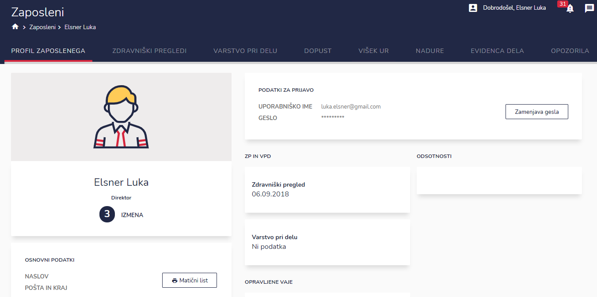

V vrstici

lahko dostopate do

* profil zaposlenega
* zdravniški pregledi
* varstvo pri delu
* dopust
* izredni dopust
* višek ur
* nadure
* evidenca dela
* opozorila
* pravice

## Profil zaposlenega

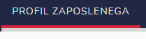

Tu dostopate do naslednjih podatkov:

* osnovni podatki
* podatki za prijavo (tu je možno tudi zamenjati geslo - postopek je opisan [tukaj](../kako-zaceti-uporabljati-ignis.md#kako-si-izberem-oz-nastavim-novo-geslo))
* zdravniški pregledi
* varstvo pri delu
* opravljene vaje
* odsotnosti
* zadolžena oprema

## Zdravniški pregledi

Tu imate pregled nad zdravniškimi pregledi in veljavnost le teh. Seznam lahko izvozite (kot XLS ali PDF datoteko) ali ga natisnete.

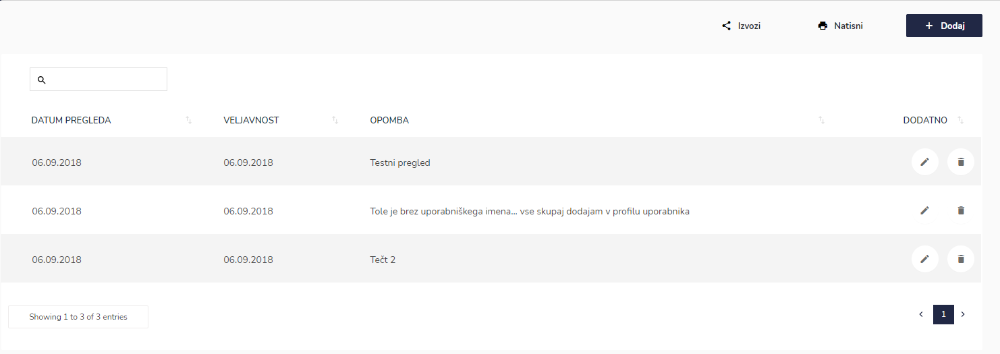

S klikom na gumb "Dodaj", lahko dodate nov zdravniški pregled.&#x20;

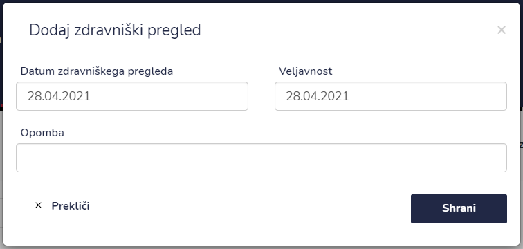

| Ime polja                       | Opis polja                                     |
| ------------------------------- | ---------------------------------------------- |
| **Datum zdravniškega pregleda** | Vpiši datum zdravniškega pregleda.             |
| **Veljavnost**                  | Vpiši datum veljavnosti zdravniškega pregleda. |
| **Opomba**                      | Prostor za dodatne opombe.                     |

Ko imate vpisane podatke s klikom na SHRANI, shranite spremembe.

## Varstvo pri delu

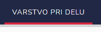

Tu imate pregled nad izpiti iz varstva pri delu in veljavnost le teh. Seznam lahko izvozite (kot XLS ali PDF datoteko) ali ga natisnete.

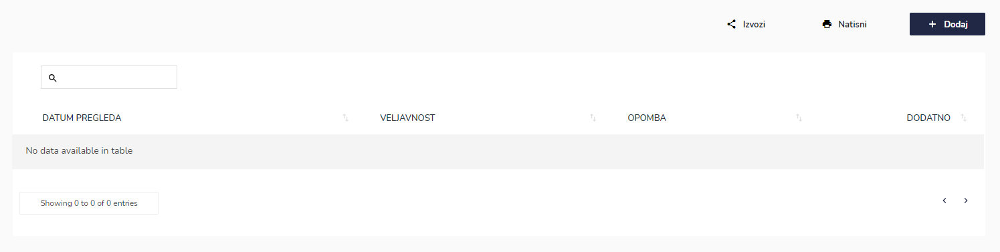

S klikom na gumb "Dodaj", lahko dodate nov izpit iz varstva pri delu. &#x20;

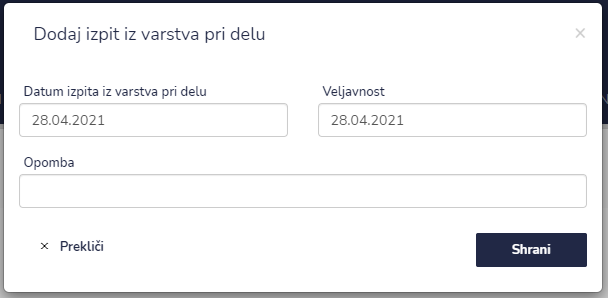

| Ime polja                            | Opis polja                                            |
| ------------------------------------ | ----------------------------------------------------- |
| **Datum izpita iz varstva pri delu** | Vpišite datum izpita iz varstva pri delu.             |
| **Veljavnost**                       | Vpišite datum veljavnosti izpita iz varstva pri delu. |
| **Opomba**                           | Prostor za dodatne opombe.                            |

Ko imate vpisane podatke s klikom na SHRANI, shranite spremembe.

## Dopust

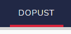

Tu imate pregled nad dopustom zaposlenega. Seznam lahko izvozite (kot XLS ali PDF datoteko) ali ga natisnete.

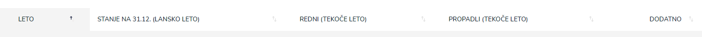

S klikom na gumb "Dodaj" vsako leto za zaposlenega vnesete, kakšno je stanje dopusta iz lanskega leta, koliko je dobil novega in koliko dopusta mu je propadlo.

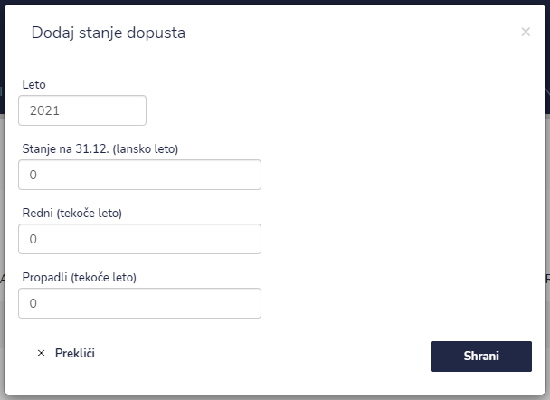

| Ime polja                           | Opis polja                                                          |
| ----------------------------------- | ------------------------------------------------------------------- |
| **Leto**                            | Vpišite letošnje leto.                                              |
| **Stanje na 31. 12. (lansko leto)** | Vpišete koliko ur dopusta je zaposlenemu ostalo iz prejšnjega leta. |
| **Redni (tekoče leto)**             | Vpišite koliko novega dopusta je dobil zaposleni v urah.            |
| **Propadli (tekoče leto)**          | Vpišite koliko dopusta je zaposlenemu propadlo v urah.              |

Ko imate vpisane podatke s klikom na SHRANI, shranite spremembe.


**Kako vpišem stanje dopusta zaposlenemu?**

Primer:

Zaposlen ima 10 dnevnih in 11 nočnih dopustov. Skupaj je to 21 delavnikov po 12 ur.&#x20;

Za zaposlenega bi v polje "**Redni (tekoče leto)**" vnesli **252** ur (21 x 12 = 252).


## Izredni dopust

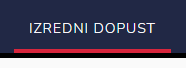

Tu imate pregled nad izrednim dopustom zaposlenega. Seznam lahko izvozite (kot XLS ali PDF datoteko) ali ga natisnete.

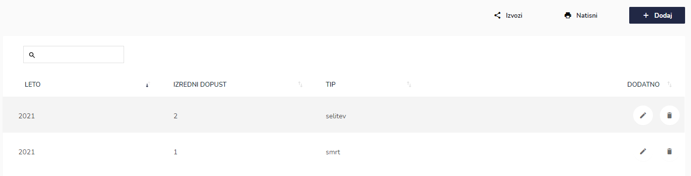

S klikom na gumb "Dodaj" zaposlenemu vnesete izredni dopust, katerega je dobil za izredni dogodek (smrt v družini, selitev, poroka...).

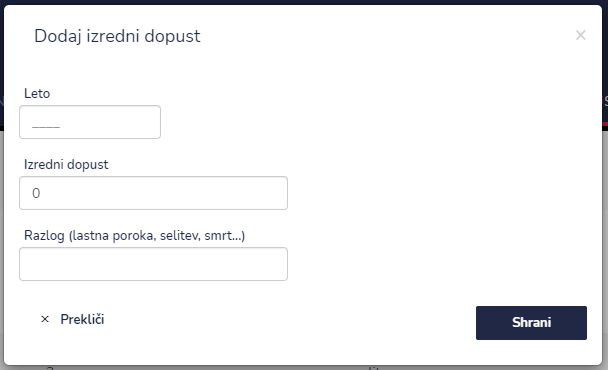

| Ime polja                                     | Opis polja                                      |
| --------------------------------------------- | ----------------------------------------------- |
| **Leto**                                      | Vpišite leto v katerem je dobil izredni dopust. |
| **Izredni dopust**                            | Vpišite število ur izrednega dopusta.           |
| **Razlog (lastna poroka, selitev, smrt,...)** | Vpišite razlog za izredni dopust.               |

Ko imate vpisane podatke s klikom na SHRANI, shranite spremembe.

## Višek ur

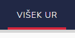

Tu imate pregled nad viškom ur zaposlenega. Seznam lahko izvozite (kot XLS ali PDF datoteko) ali ga natisnete.

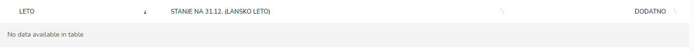

S klikom na gumb "Dodaj" zaposlenemu vnesete višek ur, katerega ima iz lanskega leta.

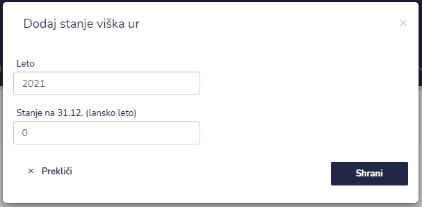

| Ime polja                           | Opis polja                                                |
| ----------------------------------- | --------------------------------------------------------- |
| **Leto**                            | Vpišite letošnje leto.                                    |
| **Stanje na 31. 12. (lansko leto)** | Vpišite koliko ima zaposleni višek ur iz prejšnjega leta. |

Ko imate vpisane podatke z klikom na SHRANI, da se spremembe shranijo.

## Nadure

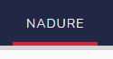

Tu imate pregled nad nadurami zaposlenega. Seznam lahko izvozite (kot XLS ali PDF datoteko) ali ga natisnete. Tabelo je namenjena potrjevanju nadurnega naloga zaposlenega, pri tistih enotah, kjer mora zaposleni potrditi svoje nadurne naloge.

.PNG>)

## Evidenca dela

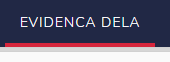

Tukaj lahko zaposleni dostopa do svoje evidence dela.


[evidenca-dela](../knjiga/evidenca-dela/)


## Opozorila

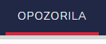

Tukaj nastavljate interval opozoril pred potekom le teh.

Opozorila si lahko nastavite za:

* Opozorilo pred potekom zdravniškega pregleda zaposlenega
* Opozorilo pred potekom izpita iz varstva pri delu zaposlenega
* Opozorilo pred potekom kompetence zaposlenega
* Opozorilo pred potekom tehničnega pregleda vozila
* Opozorilo pred potekom servisa vozila
* Opozorilo pred potekom veljavnosti pnevmatik vozila
* Opozorilo servis RGA
* Opozorilo servis IDA
* Opozorilo servis hidrantov
* Opozorilo reverz

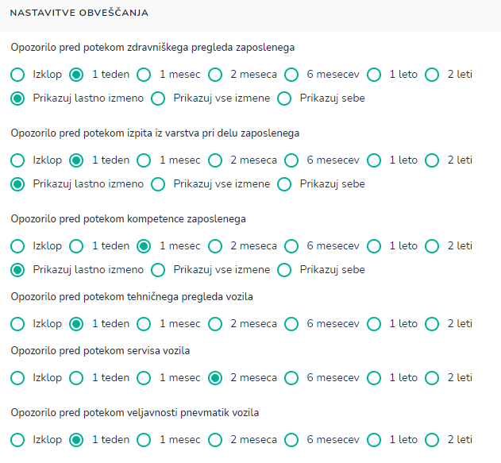

## Pravice

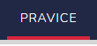

Tu dostopate do nivoja pravic zaposlenih.

Zaposlenemu lahko nastavite pravice glede na skupino, delovno mesto ali le te kopirate od izbranega zaposlenega (klik na spustni seznam).

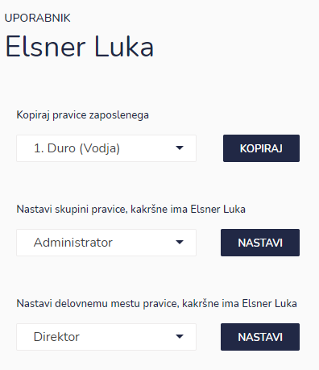

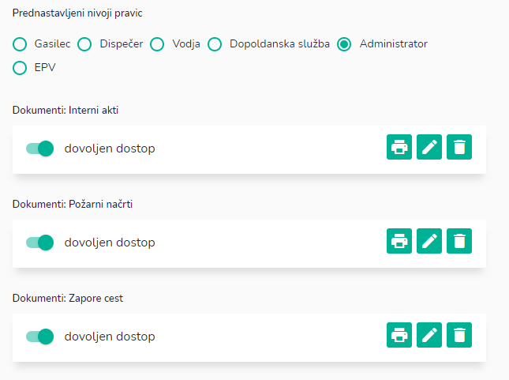

Glede na nivo pravic, lahko zaposleni dobi tudi pravice za posamezne dokumente, enote, intervencije, knjige, naloge, obrazce, obhode, opremo, zaslonov, itd.

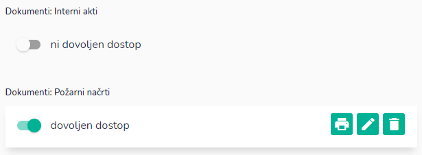

Ko imate označene pravice s klikom na SHRANI, shranite spremembe.

