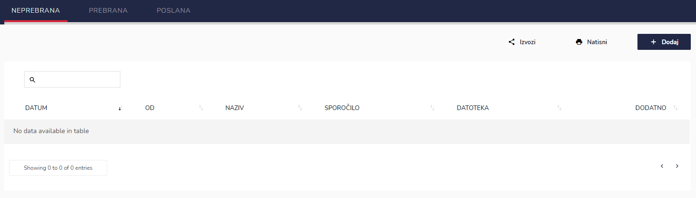
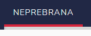
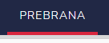
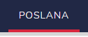
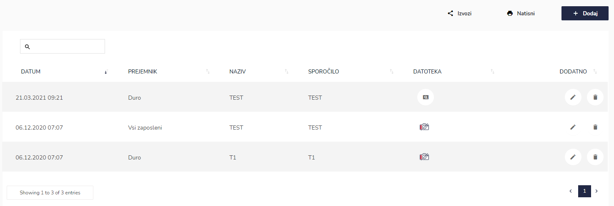
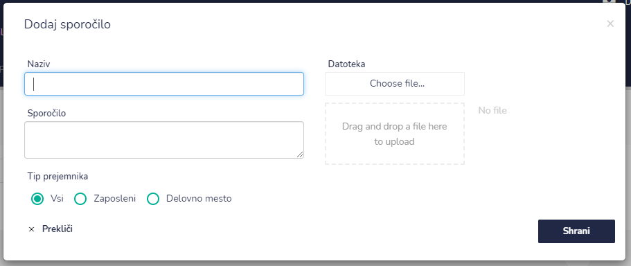
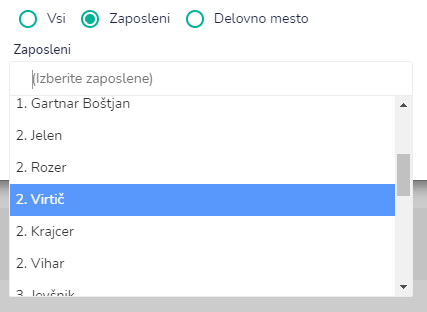
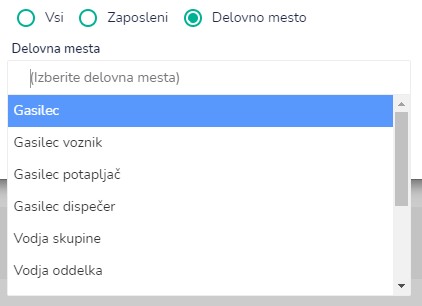

# Sporočila

Tu imate pregled nad sporočili. Seznam lahko izvozite (kot XLS ali PDF datoteko) ali ga natisnete.

#### Neprebrana sporočila

Tu vas čakajo neprebrana sporočila

#### Prebrana sporočila

Tu dostopate do že prebranih sporočil.

#### Poslana

Tu dostopate do poslanih sporočil

## Dodajanje novega sporočila

S klikom na gumb "Dodaj", lahko dodate novo sporočilo.

Napišite naziv sporočila, vsebino sporočila ter dodajte datoteko (slike, pdf, doc, itd).

Pri tipu prejemnika izbirate kdo vse je prejemnik tega sporočila. Označite lahko:

* vsi
* zaposleni&#x20;
  * tu izbirate zaposlene iz spustnega seznama

* delovno mesto
  * tu izbirate delovno mesto iz spustnega seznama

