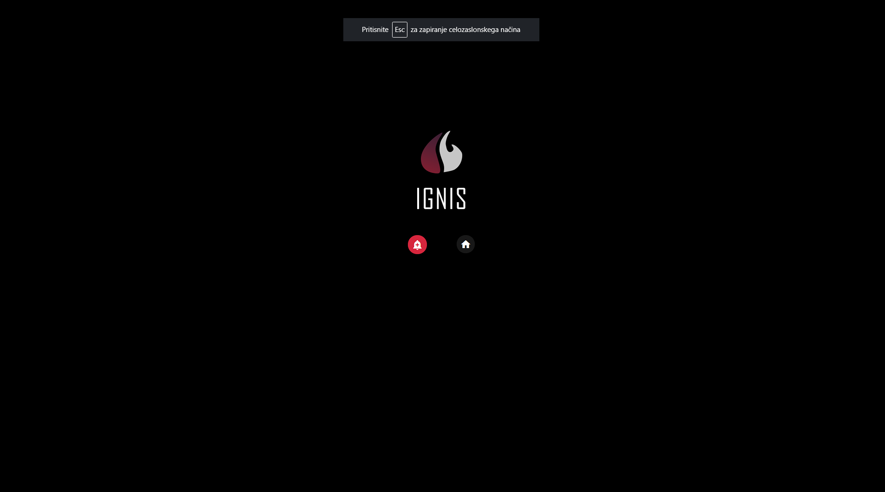

# Večerni način

S klikom na ikono za večerni način gre IGNIS v mirovanje.

Če želite zapustiti večerni način, to lahko naredite na dva načina:

* s klikom na ikono dodaj novo intervencijo

* s klikom na ikono začetni zaslon

