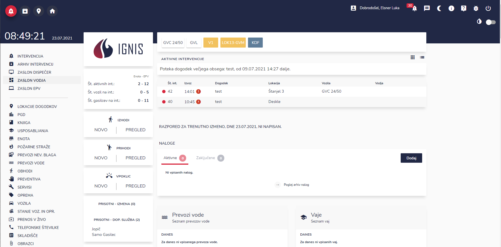
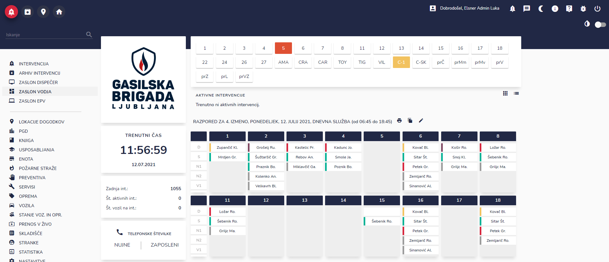
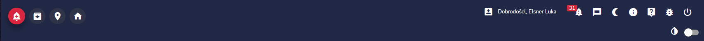
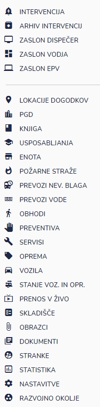
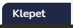
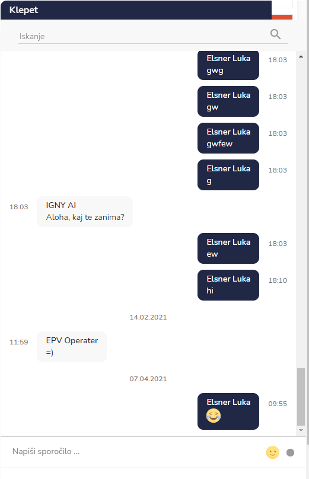
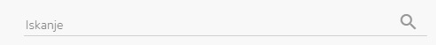
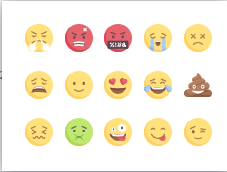
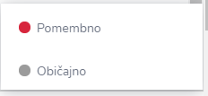

# Začetni zaslon

.png>)

Po uspešni prijavi ste vstopili na začetni zaslon. Iz njega dostopate do funkcij IGNISa.

#### Začetni zaslon je lahko (v odvisnosti od pravic zaposlenega):

* zaslon dispečer
* zaslon vodja
* zaslon EPV (Enota za podporo vodenju)
* profil zaposlenega

Dostop do osnovnih gumbov in modulov je pri vseh zaslonih postavljen enako. Dostopi so različni glede na dodeljene pravice.

.PNG>)

.PNG>)

.png>)

Do začetnega zaslona lahko vedno dostopate tudi s klikom na gumb

## Kaj lahko vidim in uporabljam na začetnem zaslonu?

### Na zgornjem delu zaslona dostopate do hitrih gumbov.

**Hitri gumbi**:&#x20;

* vnos nove intervencije&#x20;
* arhiv intervencij
* lokacije dogodkov
* začetni zaslon
* profil uporabnika
* opozorila
* sporočila
* večerni način
* dnevni/nočni način
* nadgradnje aplikacije
* pomoč
* prijava napake
* odjava

### Na levi strani zaslona dostopate do modulov

### V spodnjem desnem kotu je na voljo klepet

s klikom na Klepet lahko načnete klepet

V klepetu imate možnost iskanja (vrstica z lupo)&#x20;

in dodajanja smeškotov&#x20;

ter glede na pomembnost pogovora

Ko ne želite več uporabljati klepeta, le kliknite na klepet in ta se bo pomaknil nazaj v desni kot.
