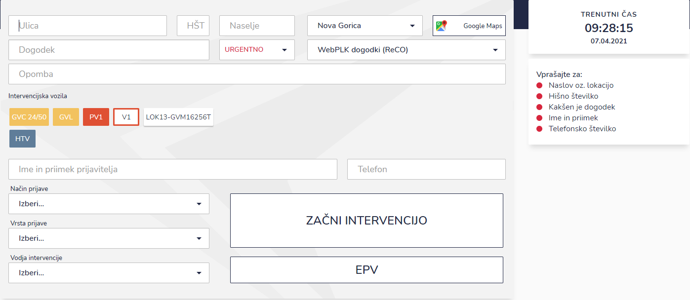

# Nova intervencija

S klikom na ikono za novo intervencijo, se vam odpre obrazec za vnos nove intervencije.


Dogodek lahko prevzamete iz URSZR bazena podatkov, tako, da ga izberete preko spustnega seznama "WebPLK dogodki (ReCO). Več o tem si lahko preberete [tukaj](../ostalo/povezava-ignis-bazen-podatkov-urszr-spin.md).


| Ime polja                       | Opis polja                                                                                                                                              |
| ------------------------------- | ------------------------------------------------------------------------------------------------------------------------------------------------------- |
| **Ulica**                       | Z vpisom nekaj črk se pojavi spustni seznam iz katerega se izbere ulica (Google Maps).                                                                  |
| **HŠT**                         | Polje za vpis hišne številke.                                                                                                                           |
| **Dogodek**                     | Opis dogodka, npr.: POŽAR. Na desni strani se izpišejo še dodatno okno z vprašanji, več si lahko preberete v namigih, ki se nahajajo spodaj.            |
| **Naselje**                     | Vpišite ime naselja.                                                                                                                                    |
| **Google Maps**                 | S klikom se odpre Google Maps zemljevid, kjer lahko vidite lokacijo ali pa izberete novo s klikom z miško. Lokacijo shranite s klikom na gumb "Shrani". |
| **Urgentno**                    | Intervencijo lahko označite kot URGENTNO, NUJNO ali NORMALNO iz spustnega seznama.                                                                      |
| **WebPLK dogodek (ReCO)**       | Spustni seznam dogodkov, ki se nahajajo v URSZR bazenu podatkov.                                                                                        |
| **Opomba**                      | Polje za vnos dodatnih opomb.                                                                                                                           |
| **Intervencijska vozila**       | Označite katera vozila bodo izvozila na intervencijo.                                                                                                   |
| **Ime in priimek prijavitelja** | Zapišite ime in priimek klicatelja.                                                                                                                     |
| **Telefon**                     | Zapišite telefonsko številko.                                                                                                                           |
| **Način prijave**               | Iz spustnega seznama izberite tip prijave (112 - Telefonska prijava, avtomatski način javljenja...)                                                     |
| **Vrsta prijave**               | Iz spustnega seznama vrsto prijave (požar, prometna nezgoda, reševanje živali...)                                                                       |
| **Vodja intervencije**          | Iz spustnega izberite osebo, katera bo vodja intervencije.                                                                                              |


S klikom na gumb "ZAČNI INTERVENCIJO" dodamo novo intervencijo in sprožimo postopke, kot so pošiljanje lokacije v navigacijske sisteme, pošiljanje email sporočil itd.

V primeru, da imamo odprt dogodek večjega obsega imamo tudi gumb "EPV" s katerim intervencijo pošljemo direktno v modul EPV, kjer intervencijo prevzamejo in obdelajo ločeno od centrale enote.


### Dodatni namigi pri vpisu nove intervencije.


Pri opisu dogodka se na desni strani zaslona izpiše dodatno okno z vprašanji. Na voljo so: PROMETNA NESREČA, POŽAR, TEHNIČNA POMOČ in NEVARNE SNOVI. S tem lahko še dodatno pridobite informacije.

&#x20;



S klikom na gumb "Google Maps" se odpre Google Maps zemljevid, kjer lahko vidite lokacijo ali pa izberete novo s klikom z miško. Lokacijo shranite s klikom na gumb "Shrani".



Ko vpisujete podatke v okno nova intervencija se vam na desni strani pojavi okno&#x20;

VPRAŠAJTE ZA:

&#x20;

Z vpisom podatkov se črtajo iz seznama vprašanja, na katera imate odgovore ter katera so še odprta.

&#x20;


