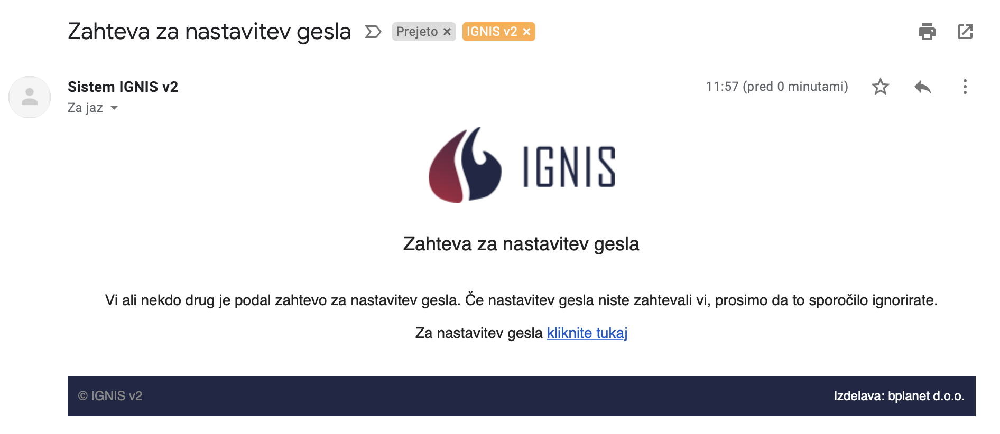

# Prijava

#### Na povezavi https://(enota\*).ignis112.si se prijavite.

\*vsaka enota ima svojo pod domeno. Na primer ljubljana.ignis112.si, kjer se prijavijo uporabniki Gasilske brigade Ljubljana.

Če ste na pravi pod domeni, lahko vidite v levem spodnjem kotu, kjer vidite naziv enote.

.PNG>)

## Kako se vpisati kot uporabnik v IGNIS?

Vpišite se z elektronskim naslovom in geslom. Po uspešnem vpisu pridete na začetni zaslon.

&#x20;&#x20;

## Imam težave z vpisom v IGNIS?

Ali imate vzpostavljeno internetno povezavo? Če nimate povezave, potem prosim poglejte ali imate težave z omrežjem. Ste pravilno napisali mail in geslo? Preverite ali ste napisali pravilno, ali pišete z malimi ali velikimi črkami. Ste na pravi pod domeni enote (Kranj, Ljubljana, Maribor, itd)?

## Kako si izberem oz. nastavim novo geslo?

S klikom na ikono se bo poslal zahtevek za zamenjavo gesla.

Na vašem e-naslovu dobite naslednje sporočilo:

Če niste zahtevali zamenjave gesla, potem sporočilo ignorirate.&#x20;

V primeru, da želite spremeniti geslo, kliknite na povezavo v sporočilu (kliknite tukaj). Odpre se novo okno v brskalniku.

Ko se odpre okno Nastavitev gesla morate vpisati novo **geslo** in **ponovi geslo**.

Geslo mora vsebovati vsaj _6 znakov_.&#x20;

Od tega mora geslo vsebovati vsaj:&#x20;

* eno veliko črko (A B C D ...),&#x20;
* eno malo črko (e f g h ...) in&#x20;
* eno številko ( 9 8 7 6 ...).

Ko imate izbrano novo geslo vpisano, kliknite NASTAVI GESLO.

Uspešno ste zaključili postopek menjave gesla. Z novim geslom se vpišete v IGNIS

V primeru, da niste uporabili vsaj ene velike črke in ene male črke ter eno številko, izbranega gesla ne boste morali uporabiti. Sitem vas ne bo spustil naprej. Prosim, upoštevajte zahteve za izbor gesla.

##

