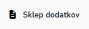

# Dodatki

Tu dostopate do seznama opravljenih dodatkov za posebne pogoje dela zaposlenih.


[uporaba-tabel-iskanje-sortiranje-izvozi-tiskanje.md](../../ostalo/uporaba-tabel-iskanje-sortiranje-izvozi-tiskanje.md)




#### Prikaži PDF

S klikom na ikono **Prikaži PDF**

se generira pdf zapis, kateri je označen.

####





.png>)

| Ime polja     | Opis polja                                                     |
| ------------- | -------------------------------------------------------------- |
| Datum začetka |                                                                |
| Datum konca   |                                                                |
| Ure           | Prikaz število ur, glede na vpisano obdobje. Ni možno urejati. |
| Zaposleni     | Kdo je upravičen do dodatka.                                   |
| Predlagal     | Kdo je predlagatelj za izplačilo dodatka.                      |
| Tip dodatka   | Kakšno delo je zaposleni opravljal.                            |
| Opis dela     | Naziv intervencije ali opis zakaj je zaposleni dobil dodatek.  |







### Kako lahko pridem do sklepa dodatkov za posamezni mesec?

S klikom na ikono **Sklep dodatkov**

se odpre

S pomočjo&#x20;

spustnega seznama za mesec in leto lahko izbirate izpis za željen mesec in leto.

