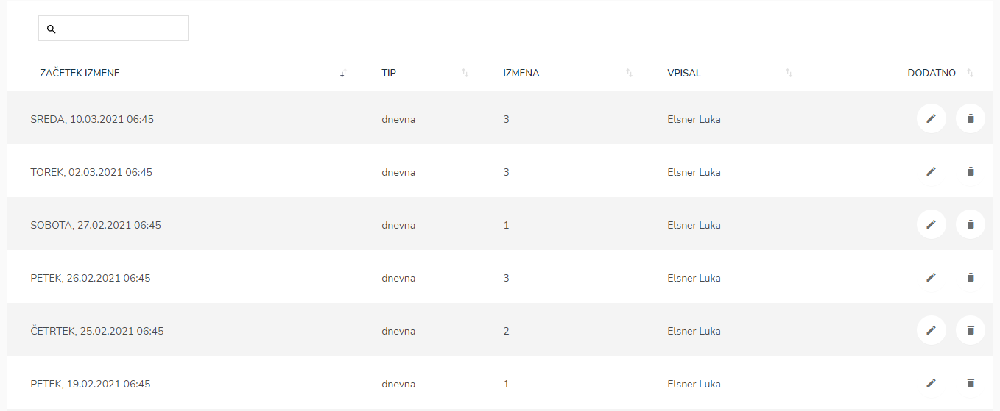
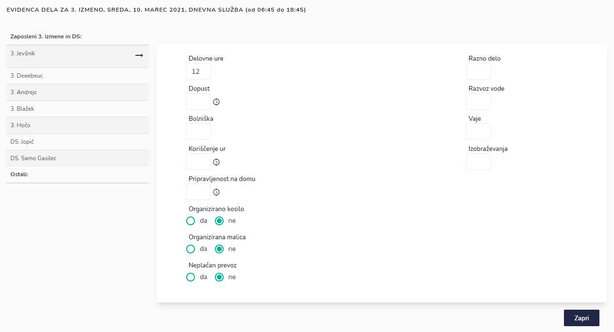
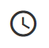
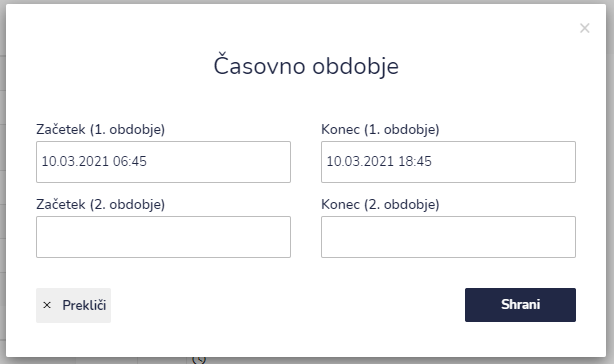

# Evidenca dela

Tu dostopate do seznama evidenc dela.


[uporaba-tabel-iskanje-sortiranje-izvozi-tiskanje.md](../../ostalo/uporaba-tabel-iskanje-sortiranje-izvozi-tiskanje.md)






IGNIS samodejno prepozna za kateri delovnik je bil narejen razpored dela, ni pa bila narejena evidenca dela. S klikom na predlagani razpored, se samodejno ustrezno izpolnijo polja.



V primeru, da ste izbrali napačen datum (izbrana izmena takrat ne opravlja službe) vas bo IGNIS na to opozoril.

&#x20;


Ko kliknete gumb "**Dodaj**", vas preusmeri na zaslon za urejanje evidence dela. Več o tem si preberite na zavihku "**Uredi**".




Pri **dopustu**, **koriščenju ur** in **pripravljenosti na domu** je potreben vnos časovnega obdobja.


Ker nekatere enote koristijo dopust po urah (na primer od 7:00 do 8:00) je pri **dopustu**, **koriščenju ur** in **pripravljenosti na domu** potreben vnos časovnega obdobja.


Če nekdo koristi dopust dvakrat v enem delovniku (na primer od 7:00 do 8:00 in od 18:00 do 19:00) je potrebno vnesti začetek in konec 1. obdobja, ter začetek in konec 2. obdobja.




.png>)




