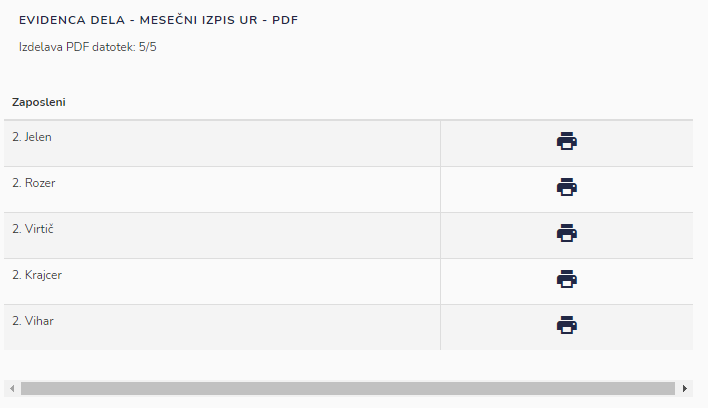
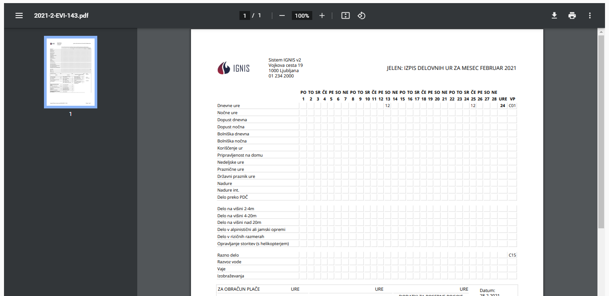

# Izmenski izpis ur

Izberite izmeno, mesec in leto, ter kliknite gumb "Generiraj".

Sistem bo naredil PDF datoteke za vse zaposlene.

S klikom na tiskalnik pri posameznem zaposlenem, se vam bo PDF dokument odprl v novem zavihku za izbranega zaposlenega. Ta PDF dokument lahko izvozite ali natisnete.

Če želite PDF za celotno izmeno, kliknete na gumb "Natisni".

.png>)
