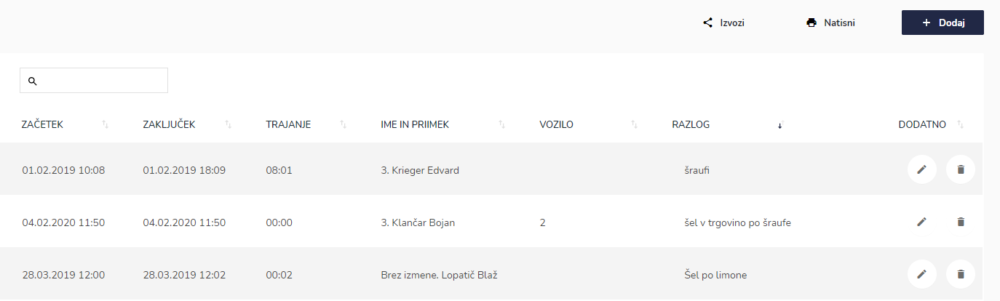
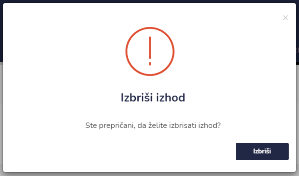

# Izhodi

Tu dostopate do seznama izhodov iz enote.




.png>)

| Ime polja                | Opis polja                                                                                      |
| ------------------------ | ----------------------------------------------------------------------------------------------- |
| Datum in ura začetka     | Datum in čas odhoda iz enote.                                                                   |
| Datum in ura zaključka   | Datum in čas prihoda v enoto.                                                                   |
| Razlog                   | Točenje goriva, sestanek na drugi lokaciji...                                                   |
| Vozilo                   | Službeno vozilo, lastno vozilo, brez vozila.                                                    |
| Zaposlen                 |                                                                                                 |
| ali vpiši ime in priimek | V primeru nezaposlenega (prostovoljni gasilec, druge osebe), je potrebno vnesti ime in priimek. |
| Generiraj potni nalog    | Ob zaključku izhoda se avtomatsko generira potni nalog za izbrano vozilo.                       |







