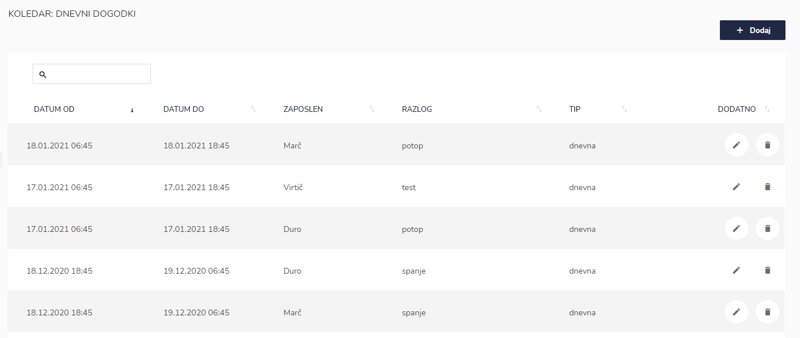
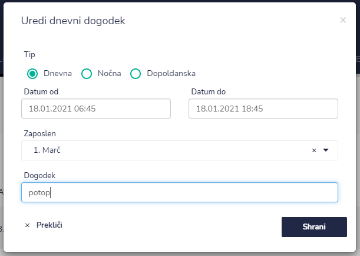

# Koledar: Dnevni dogodki

Tu dostopate do dnevnih dogodkov koledarju.


[uporaba-tabel-iskanje-sortiranje-izvozi-tiskanje.md](../ostalo/uporaba-tabel-iskanje-sortiranje-izvozi-tiskanje.md)





| Ime polja | Opis polja                                     |
| --------- | ---------------------------------------------- |
| Tip       | Kateri izmene je dogodek namenjen.             |
| Datum od  |                                                |
| Datum do  |                                                |
| Zaposlen  |                                                |
| Dogodek   | Potop, obisk predsednika, ogled tovarne Rog... |



.png>)


