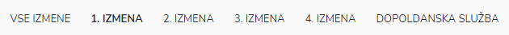
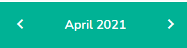
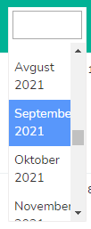
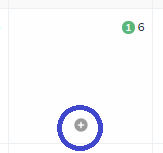
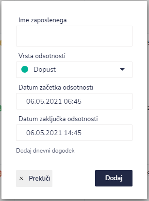
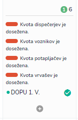
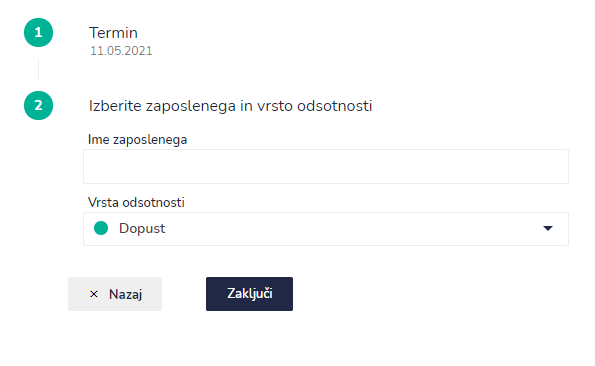

# Koledar

Koledar je namenjen zaposlenim za rezervacijo odsotnosti (na primer dopusta).

Če imate dovolj pravic, lahko menjate prikaz odsotnosti.&#x20;

.PNG>)

### Pregled izmene za določen mesec

Če želite pogledati izmene za določen mesec to lahko storite s klikom na:&#x20;

* puščice **< >** se premikate po posameznih mesecih za nazaj ali naprej
* **mesec leto** se odpre spustni seznam

### Kako vpišem odsotnost zaposlenega?

To lahko naredite na dva načina.

&#x20;**1. NAČIN**

S klikom na **+** za točno določen dan v koledarju.

Odpre se okno

iz spustnega seznama izberete zaposlenega, vrsto odsotnosti, datum začetka in zaključka odsotnosti. Ko imate vpisane vse podatke s klikom na DODAJ se vpiše v koledar.&#x20;

V primeru, da so kvote manjkajočih dosežene se to tudi izpiše. Zaposleni se bo še vedno lahko rezerviral, vendar lahko pričakuje, da mu bo vodja zavrnil prošnjo za odsotnost.

&#x20;**2. NAČIN**

Ta način je uporaben v primeru, če se rezervira odsotnost za več dni zaporedoma (na primer zaposleni rezervira odsotnost za 3 nočne in 3 dnevne izmene).

V prvem koraku izberemo dni.

.png>)

V drugem koraku izberemo zaposlene in vrsto odsotnosti.

S klikom na gumb "Zaključi" se shranijo rezervacije odsotnosti v koledar.&#x20;

