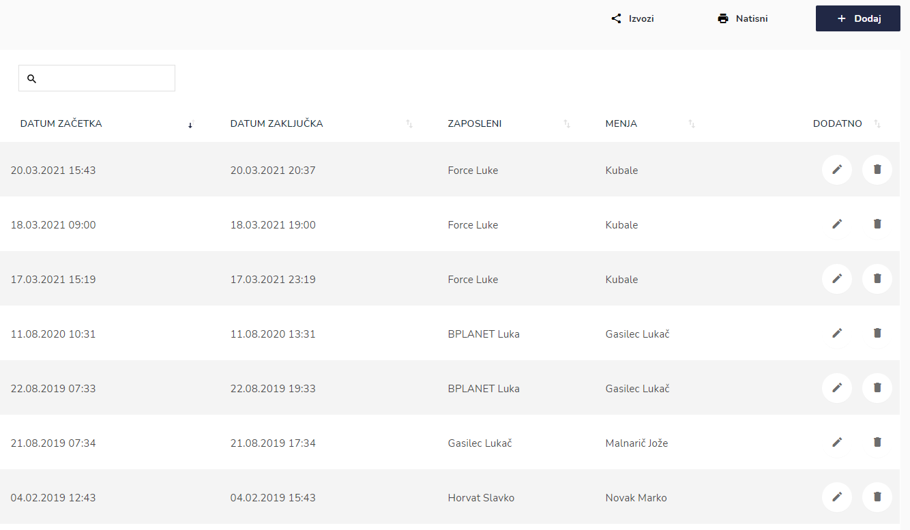
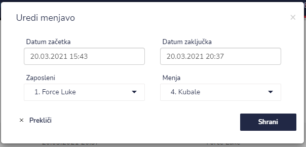
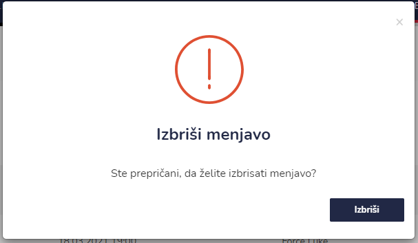

# Menjave

Tu lahko vidite vse menjave.


[uporaba-tabel-iskanje-sortiranje-izvozi-tiskanje.md](../ostalo/uporaba-tabel-iskanje-sortiranje-izvozi-tiskanje.md)





| Ime polja       | Opis polja                                  |
| --------------- | ------------------------------------------- |
| Datum začetka   |                                             |
| Datum zaključka |                                             |
| Zaposleni       | Zaposleni kateri menja drugega zaposlenega. |
| Menja           | Zaposleni kateri ga menja drugi zaposleni.  |







Menjave so vidne na "Zaslon vodja".

.png>)
