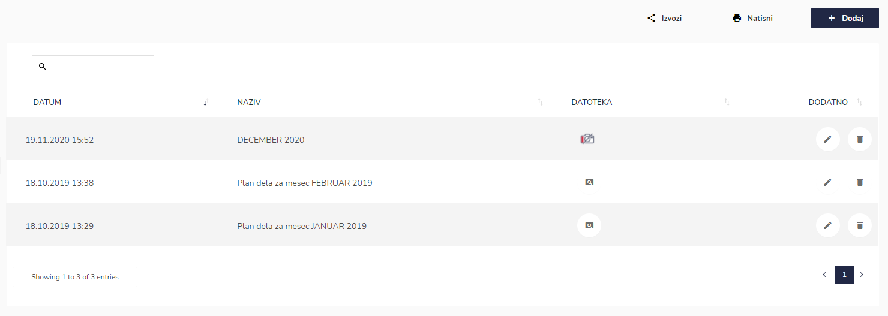
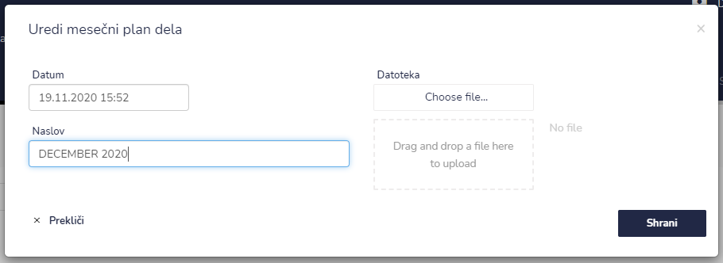
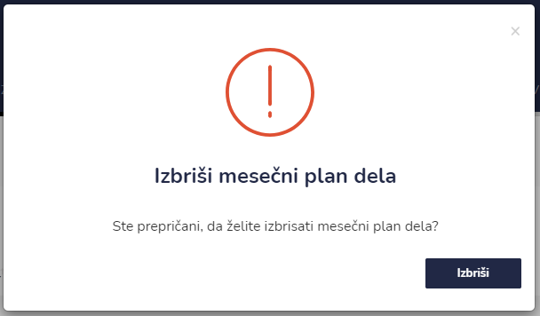

# Mesečni plan dela

Tu dostopate do seznama mesečnega plana dela.


[uporaba-tabel-iskanje-sortiranje-izvozi-tiskanje.md](../ostalo/uporaba-tabel-iskanje-sortiranje-izvozi-tiskanje.md)





| Ime polja | Opis polja                                        |
| --------- | ------------------------------------------------- |
| Datum     | Ddatum vnosa                                      |
| Naslov    | Ponavadi MESEC in LETO (na primer DECEMBER 2021). |
| Datoteka  | Datoteka v formatu PDF.                           |







Datoteke so vidne na "Zaslon vodja".

.png>)


Mesečni plan dela je enoti vidno, če ima funkcionalnost vklopljeno v globalnih nastavitvah.


