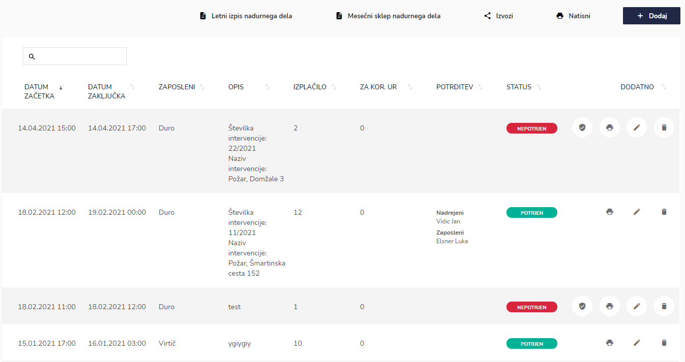
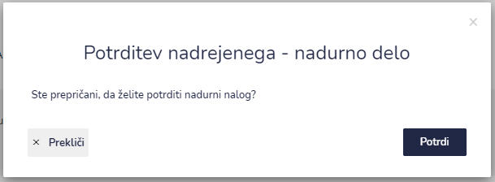
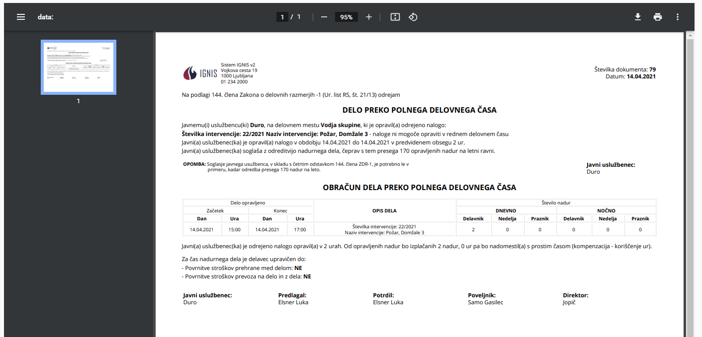
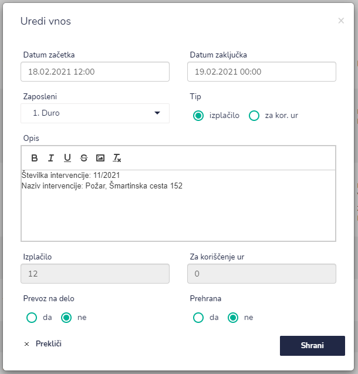
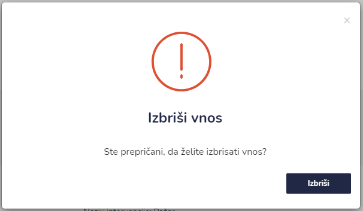

# Nadurno delo

Tu dostopate do seznama nadurnega dela.


[uporaba-tabel-iskanje-sortiranje-izvozi-tiskanje.md](../../ostalo/uporaba-tabel-iskanje-sortiranje-izvozi-tiskanje.md)



Pri potrjevanju nadurnih nalogov sta dve možnosti, in sicer "enostopenjsko" ali "dvostopenjsko". Pri enostopenjskem potrjevanju nadurni nalog potrdi zgolj nadrejeni, medtem ko ga mora pri dvostopenjskem potrditi tudi zaposleni, kateri je opravil nadure. Nastavitev je vezana na globalne nastavitve enote.








.png>)

Zaposleni označi "Prevoz na delo" in potrdi nadurni nalog.




####




Tu lahko posamezni vnos urejate in popravljate. Ko imate vpisane vse podatke s klikom na **Shrani**, shranite spremembe.






