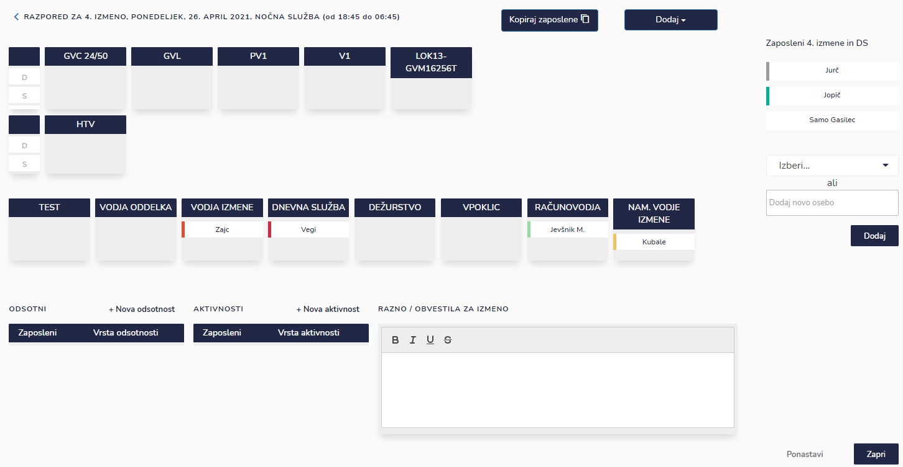
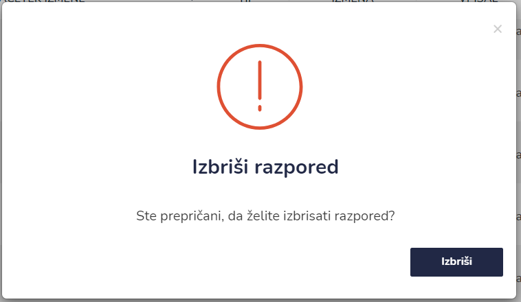
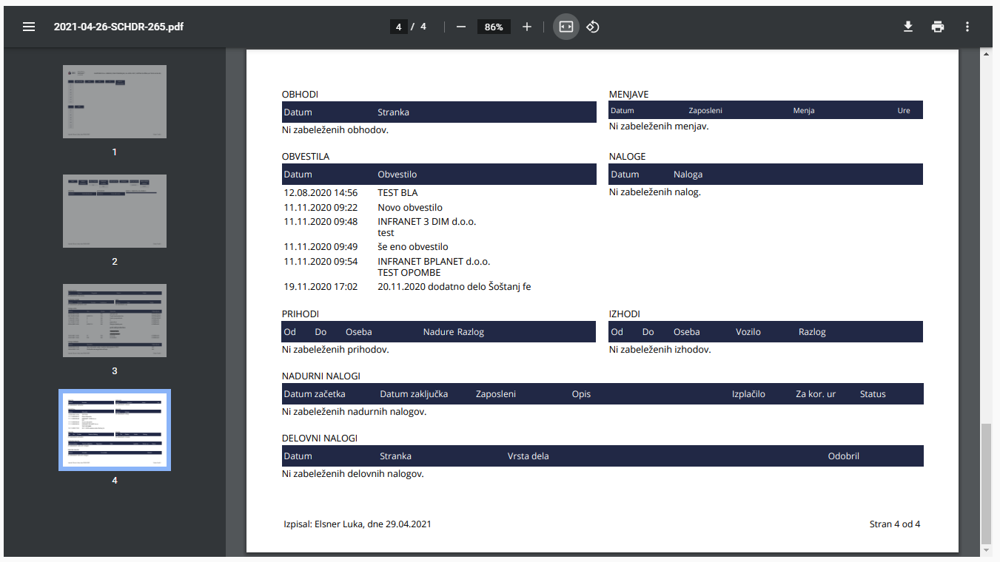

# Pregled razporedov

Tu dostopate do seznama narejenih razporedov.

.PNG>)


[uporaba-tabel-iskanje-sortiranje-izvozi-tiskanje.md](../ostalo/uporaba-tabel-iskanje-sortiranje-izvozi-tiskanje.md)




.png>)

| Ime polja | Opis polja               |
| --------- | ------------------------ |
| Izmena    |                          |
| Datum     |                          |
| Tip       | Dnevna ali nočna izmena. |




Zaposlene razporejate po vozilih in pozicijah s tako imenovanim manevrom "Drag\&Drop".

V primeru, da opravlja izmeno, kakšen zaposleni iz druge izmene, ga dodate na levi, kjer ga izberete iz spustnega seznama in kliknete "Dodaj". V primeru dežurstva kakšnega gasilca iz prostovoljnega gasilskega društva, vpišete ime in priimek in kliknete "Dodaj".

.png>)

Zaposlene lahko kopirate iz enega vozila na drugega.

.png>)

.png>)








.png>)







##
