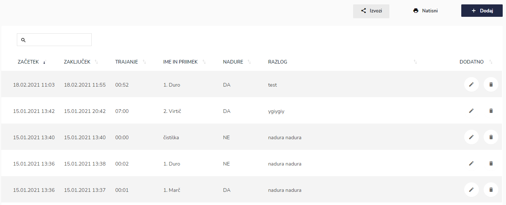
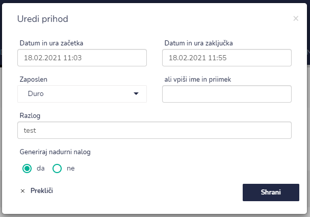
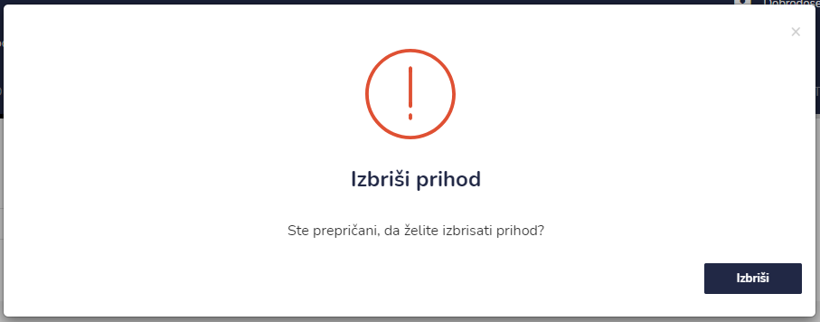

# Prihodi

Tu dostopate do seznama prihodov v enoto.




| Ime polja                | Opis polja                                                                                |
| ------------------------ | ----------------------------------------------------------------------------------------- |
| Datum in ura začetka     | Datum in čas prihoda v enoto.                                                             |
| Datum in ura zaključka   | Datum in čas odhoda iz enote.                                                             |
| Zaposlen                 |                                                                                           |
| ali vpiši ime in priimek | V primeru nezaposlenega (čistilka, serviser, gost...), je potrebno vnesti ime in priimek. |
| Razlog                   | Sestanek, vpoklic zaradi intervencije...                                                  |
| Generiraj nadurni nalog  | Ob zaključku prihoda se avtomatsko generira nadurni nalog.                                |




###


