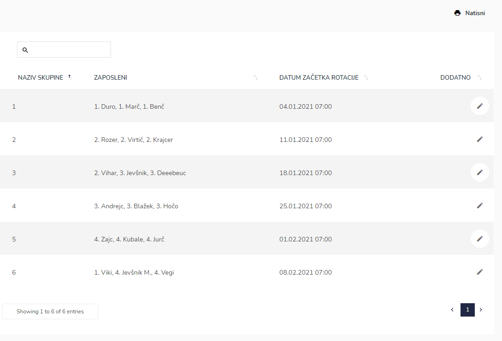

# Pripravljenost na domu

Tu dostopate do seznama pripravljenost na domu.

.png>)


[uporaba-tabel-iskanje-sortiranje-izvozi-tiskanje.md](../ostalo/uporaba-tabel-iskanje-sortiranje-izvozi-tiskanje.md)



Možni so trije načini vnosa pripravljenosti na domu. In sicer po "posamezniku", po "skupini" ali preko "rezervacije" v koledarju. Nastavitev je vezana na globalne nastavitve enote.


Ko vnesemo pripravljenost na domu, se vnosi avtomatsko prenesejo v "Razpored" in sicer na pozicijo, ki je temu namenjena.

### 1. način - po posamezniku

V tem načinu, za vsakega zaposlenega posebej določite obdobje od kdaj do kdaj je v pripravljenosti na domu.



.png>)

.png>)

| Ime polja | Opis polja |
| --------- | ---------- |
| Zaposlen  |            |
| Datum od  |            |
| Datum do  |            |




.png>)



### 2. način - po skupinah

V tem načinu imate določene skupine, kjer v vsako skupino določite zaposlene. Vsaka skupina je v pripravljenosti 1 teden, nato je avtomatsko v pripravljenosti naslednja skupina. Ko zadnja skupina zaključi s pripravljenostjo, je ponovno v pripravljenosti prva skupina.



.png>)

.png>)

| Ime polja | Opis polja                            |
| --------- | ------------------------------------- |
| Naziv     | Naziv skupine, na primer 1.           |
| Zaposleni | Določimo vse zaposlene za to skupino. |


Za število skupin in datum začetka rotacij določenih skupin nas kontaktirajte.




### 3. način - preko rezervacije v koledarju

V tem načinu si lahko zaposleni rezervirajo pripravljenost na domu na enak način kot to naredijo za rezervacijo odsotnosti. Ko si zaposleni rezervira pripravljenost na domu so pooblaščene osebe o tem obveščene preko elektronske pošte, katere nato rezervacijo potrdijo ali zavrnejo.


Zaposleni si lahko rezervirajo pripravljenost na domu samo v svoji "dnevni" izmeni, v pripravljenosti so nato avtomatsko od konca dnevne izmene, do začetka nočne izmene naslednji dan (skupaj 24 ur).


S klikom na dnevno izmeno se odpre pojavno okno:

.png>)

Zaposleni klikne na "**Dodaj pripravljenost na domu**".

.png>)

S klikom na gumb "Dodaj", se opravi rezervacija, katero mora nato pooblaščena oseba potrditi.

**V vseh treh načinih velja:** Ko boste kasneje naredili razpored, se bodo avtomatsko vanj prenesle potrjene rezervacije pripravljenosti na domu.

.png>)

Iz razporeda pa se bodo avtomatsko prenesle ure pripravljenosti na domu v evidenco dela.

.png>)
