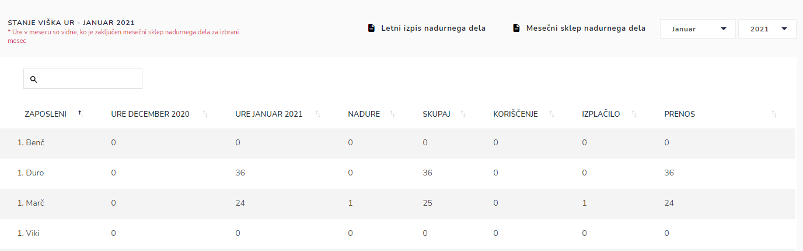

# Stanje viška ur

Tu dostopate do pregleda stanja viška ur zaposlenih.

Podatki so zbrani iz **nadurnega dela**, **mesečnega sklepa nadurnega dela** in **evidence dela**.


Ure v mesecu so vidne, ko je zaključen mesečni sklep nadurnega dela za izbrani mesec.



[mesecni-sklep-nadurnega-dela.md](../nadurno-delo/mesecni-sklep-nadurnega-dela.md)



[evidenca-dela](../evidenca-dela/)



[nadurno-delo](../nadurno-delo/)


