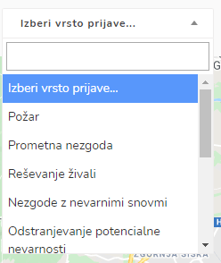

# LOKACIJE DOGODKOV

S klikom na ikono za lokacijo dogodkov se vam odpre grafični prikaz intervencij na zemljevidu.

.PNG>)


Če je intervencij na zemljevidu preveč, jih lahko združite z gumbom "ZDRUŽI INTERVENCIJE".


#### Izberete lahko prikaz aktivnih ali vseh intervencij.

#### Izberete lahko prikaz intervencij glede na vrsto prijave.

#### Izberete lahko prikaz intervencij glede na dogodek večjega obsega.

#### Izberete lahko prikaz intervencij glede na časovno obdobje.

#### Reliefni prikaz zemljevida ali satelit

