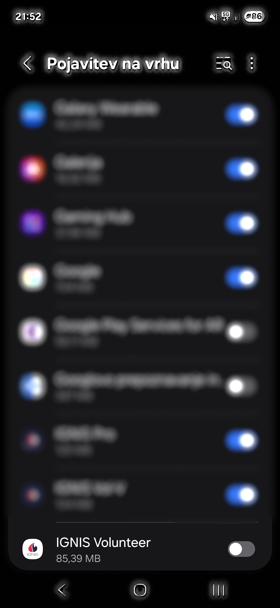
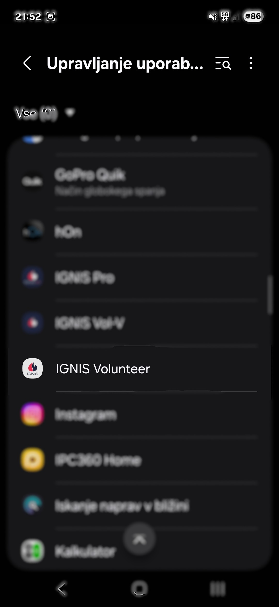
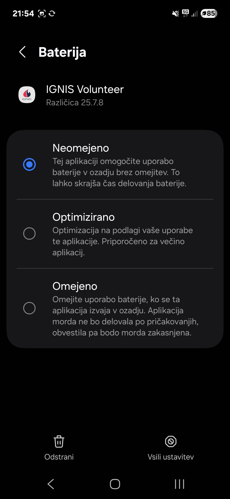

# Android: Namestitev in dovoljenja

Da bi aplikacija Ignis Volunteer pravilno delovala, jo je pred uporabo potrebno pravilno namestiti in omogočiti dovoljenja.

<figure><figcaption></figcaption></figure>

<figure><figcaption></figcaption></figure>

<figure><figcaption></figcaption></figure>

<figure><figcaption></figcaption></figure>

<figure><figcaption></figcaption></figure>

<figure><figcaption></figcaption></figure>

<figure><figcaption></figcaption></figure>

<figure><figcaption></figcaption></figure>

<figure><figcaption></figcaption></figure>
