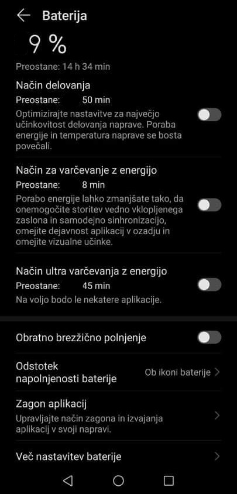
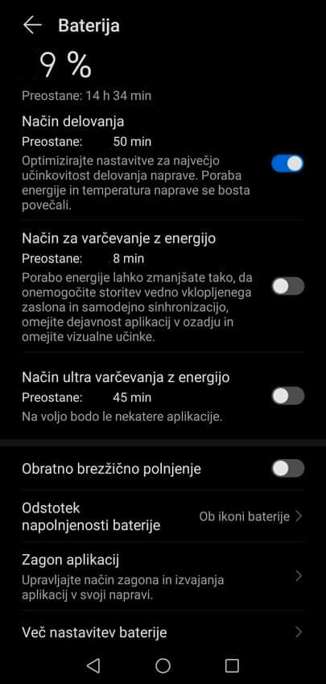
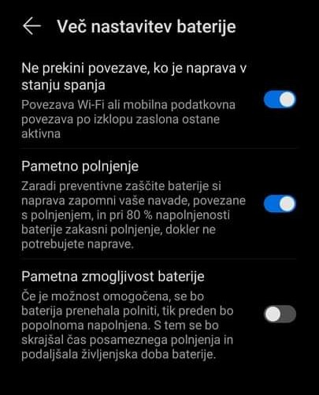
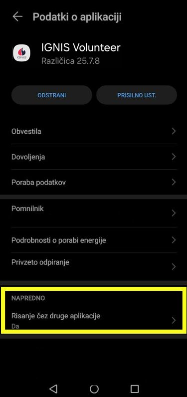
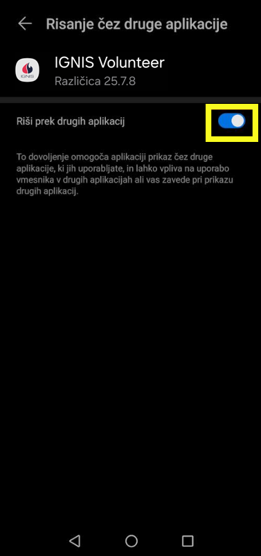

# Nastavitve: Huawei naprave

**1. Izključitev varčevalnika z energijo**

V nastavitvah telefona izberite meni APLIKACIJE in  zavihek ZAGON APLIKACIJ. Preklopite na ROČNO UPRAVLJANJE.

<figure><figcaption></figcaption></figure>

<figure><figcaption></figcaption></figure>

**2. Izključite vseh varčevalnikov z energijo.**

<figure><figcaption></figcaption></figure>

**3. Vključite NAČIN DELOVANJA.**

<figure><figcaption></figcaption></figure>

**4. Omogočite delovanje WIFI povezave.**

<figure><figcaption></figcaption></figure>

**5. Vključite dovoljenja za risanje čez druge aplikacije.**

<figure><figcaption></figcaption></figure>

<figure><figcaption></figcaption></figure>
