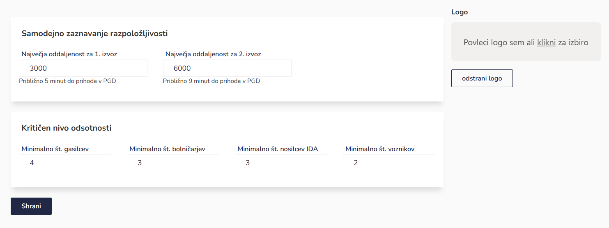

# \*IGNIS BRIDGE - SMS

Brez interneta? Ni panike! Z aplikacijo IGNIS Bridge ustvariš povezavo med prejetim SMS sporočilom in aplikacijo IGNIS Volunteer. Tako boš tudi brez interneta alarmiran in boš lahko oddal svoj odziv preko avtomatiziranega klica.

Ignis bridge preneseš na prvi strani Ignis Volunteer. Po prenosu je potrebno dovoliti vsa potrebna dovoljenja. Pri dovoljenju za SMS-e je potrebna posebna pozornost, saj je omogočanje dovoljenja zahtevnejše.&#x20;

1. Odpri nastavitve - aplikacije - Ignis Bridge
2. Desno zgoraj pritisni na gumb (⋮) - dovoli omejene nastavitve - potrdi identiteto
3. Dovoljenja - SMS - Dovoli

<figure><figcaption></figcaption></figure>
