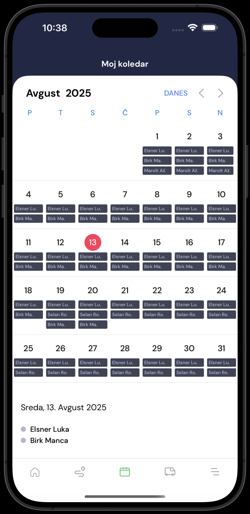

# Moj koledar

Na koledarju vidimo vnešene odsotnosti gasilcev. S klikom na datum in pritiskom na gumb "dodaj odostnost", lahko vnesemo našo odsotnost. S tem vnesemo našo odsotnost v primeru intervencije in hkrati v aplikaciji izklopimo aktiviranje v primeru intervencije.

<figure><figcaption></figcaption></figure>
