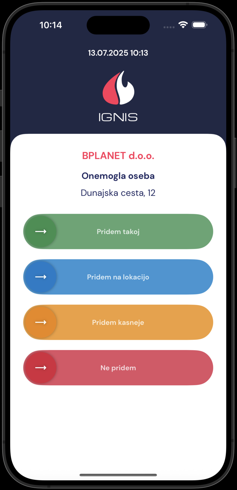

# Prva stran

Na prvi strani vidimo: **trenutno število gasilcev, ki so na voljo, aktivna obvestila** ali **aktivne intervencije, zadnjih 20 aktivacij, pomembne številke** in **neoperativne enote in vozila.**&#x20;

<figure><figcaption></figcaption></figure>

Dodaj obvestilo:

<figure><figcaption></figcaption></figure>

Zaslon ob aktivaciji in pregled intervencije:

<figure><figcaption></figcaption></figure>

<figure><figcaption></figcaption></figure>
