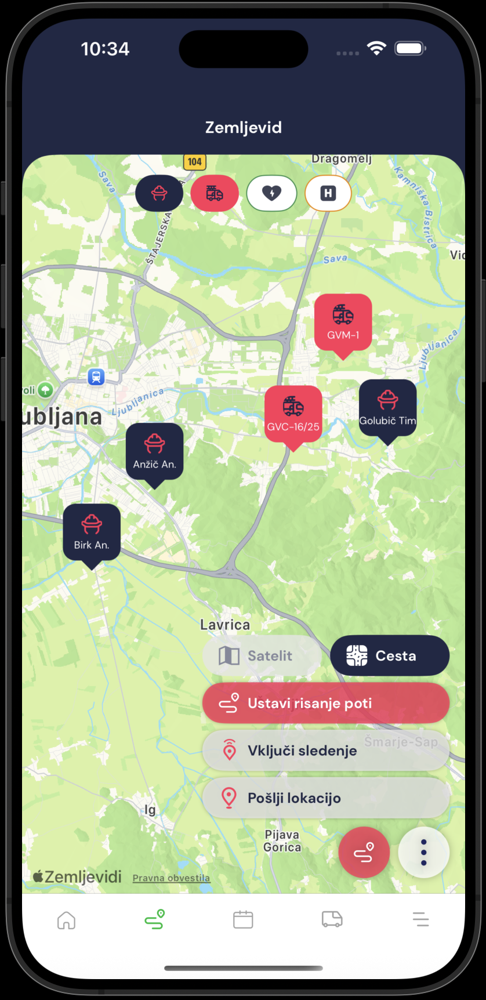

# Zemljevid

Na zemljevidu vidimo zadnje lokacije gasilcev in vozil. Na zgornjem meniju lahko prikažemo ali skrijemo: gasilce, vozila, lokacije AED in hidrantov.

S klikom na gumb (...) se nam odprejo možnosti za preklop med načinom zemljevida _satelit_ in _cesta._&#x20;

Možnosti oddajanja lokacije: **Pošlji lokacijo** (odda lokacijo samo 1x), **Vključi sledenje** (oddaja lokacijo ves čas) in **Začni risanje poti** (Oddaja lokacijo ves čas in riše pot gibanja po zemljevidu)

<figure><figcaption></figcaption></figure>
