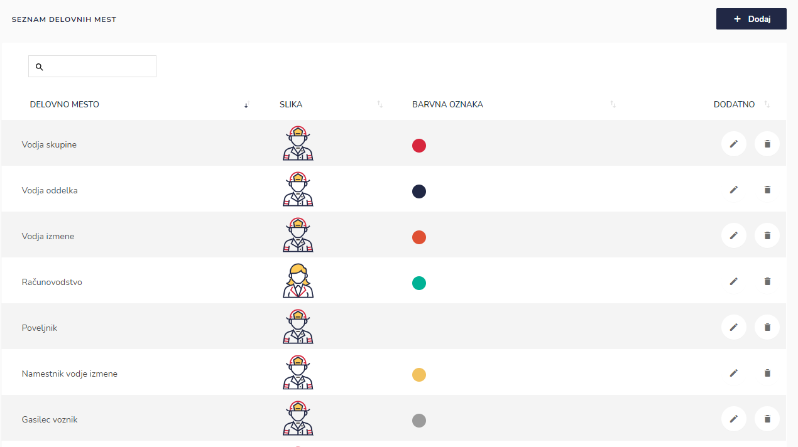
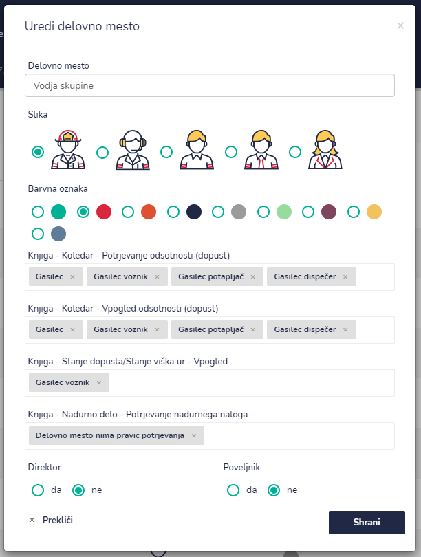
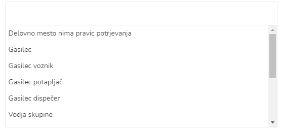
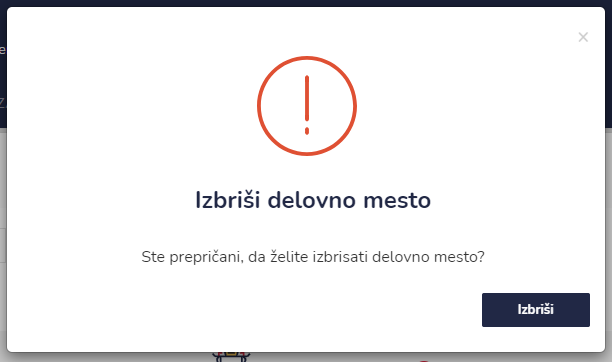

# Zaposleni

Tu dostopate do seznama delovnih mest.


[uporaba-tabel-iskanje-sortiranje-izvozi-tiskanje.md](../../ostalo/uporaba-tabel-iskanje-sortiranje-izvozi-tiskanje.md)





| Ime polja                                                                                                                                                                                                                                                                                                                                                                           | Opis polja                                                                                                                                                                           |
| ----------------------------------------------------------------------------------------------------------------------------------------------------------------------------------------------------------------------------------------------------------------------------------------------------------------------------------------------------------------------------------- | ------------------------------------------------------------------------------------------------------------------------------------------------------------------------------------ |
| **Delovno mesto**                                                                                                                                                                                                                                                                                                                                                                   | Napišite ime delovnega mesta                                                                                                                                                         |
| **Slika**                                                                                                                                                                                                                                                                                                                                                                           | Izberite sliko. Ta bo vidna v profilu zaposlenega.                                                                                                                                   |
| **Barvna oznaka**                                                                                                                                                                                                                                                                                                                                                                   | Označite barvno oznako delovnega mesta.                                                                                                                                              |
| 
<strong>Knjiga - Koledar - Potrjevanje odsotnosti (dopust)</strong>

<strong>--</strong>

<strong>Knjiga - Koledar - Vpogled odsotnosti (dopust)</strong>

<strong>--</strong>

<strong>Knjiga - Stanje dopusta/Stanje viška ur - Vpogled</strong>

<strong>--</strong>

<strong>Knjiga - Nadurno delo - Potrjevanje nadurnega naloga</strong>
 | 
S pomočjo spustnega seznama izberite  pravice potrjevanja.

 |
| **Direktor**                                                                                                                                                                                                                                                                                                                                                                        | Označite z da ali ne.                                                                                                                                                                |
| **Poveljnik**                                                                                                                                                                                                                                                                                                                                                                       | Označite z da ali ne.                                                                                                                                                                |







