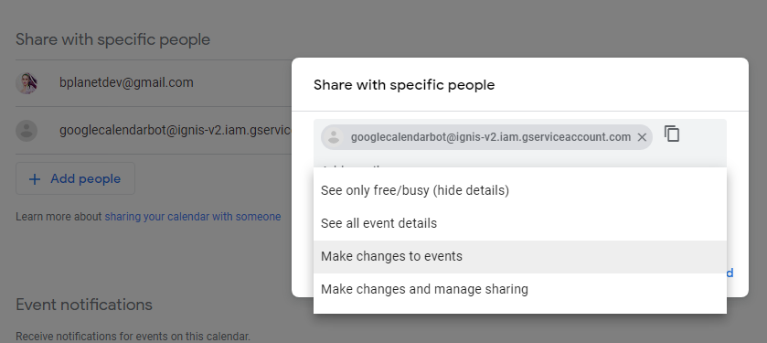
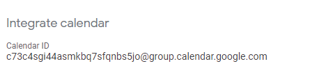
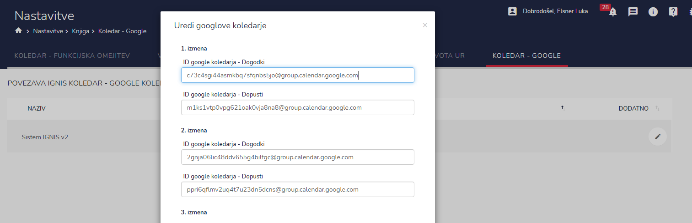
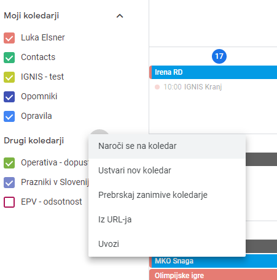
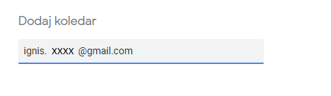
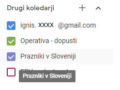

# Koledar - Google

## Povezava IGNIS koledar in Google koledar

1\. V "google calendar" morate narediti nov koledar (če ga še nimate) in v nastavitvah pod "Share with specific people" dodati email IGNIS service bota (**ZA NASLOV NAS KONTAKTIRAJTE**, saj ga moramo ustvariti za vsako enoto posebej), ter mu izberete pravico "Make changes to events"

2\. Nato nižje kopirate "Calendar ID".

3\. Ta ID kopirate v IGNIS in sicer v "NASTAVITVE -> Knjiga -> KOLEDAR - GOOGLE" v polje, ki je skladno s koledarjem (izmena, dogodek - odsotnost)

Ta postopek ponovite za vseh 10 koledarjev (5 izmen za dogodke in 5 izmen za odsotnosti). Če boste uporabljali samo 1 google koledar, vnesite v vsa polja (ali samo tista, ki želite, da se sinhronizirajo) isti "Calendar ID".

## Dodajanje IGNIS koledarja v svoj google koledar

Na levi strani imate "Moji koledarji" in "Drugi koledarji".

Pod "Drugi koledarji" kliknete + in Naroči se na koledar:

V polje vnesite email koledarja, katerega želite dodati (naprimer "ignis.XXXX@gmail.com") in pritisnite enter:

Sedaj boste videli dogodke enote v vašem koledarju. Pogled dogodkov lahko vklapljate in izklapljate s klikom na "checkbox":

