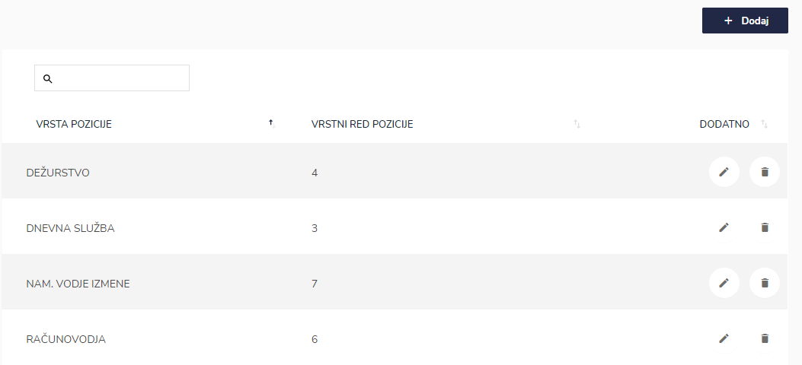
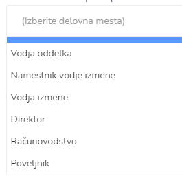
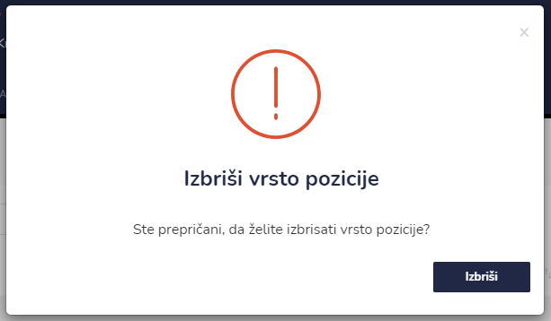

# Pozicije




.PNG>)

| Ime polja                                                            | Opis polja                                                                                                                                                                          |
| -------------------------------------------------------------------- | ----------------------------------------------------------------------------------------------------------------------------------------------------------------------------------- |
| **Naziv**                                                            | Vpišite naziv pozicije.                                                                                                                                                             |
| **Vrstni red**                                                       | Napišite vrstni red (npr. 3).                                                                                                                                                       |
|  **1. Avtomatično vpiši zaposlene na vpoklic**                       | Označite z da ali ne.                                                                                                                                                               |
|  **2. Avtomatično vpiši ure pripravljenost na domu (evidenca dela)** | Označite z da ali ne.                                                                                                                                                               |
|  **3.1. Avtomatično vpiši zaposlene z delovnim mestom**              | 
S pomočjo spustnega sezna izberite delovno mesto.

  
 |
|  **3.2. in izmeno**                                                  | 
Označite: 
<ul><li> Službojoča izmena</li><li>Službojoča izmena in dopoldanska služba</li><li>Dopoldanska služba</li></ul>                                                    |
|   **4. Izdajatelj potnih nalogov**                                   | Označite z da ali ne.                                                                                                                                                               |








