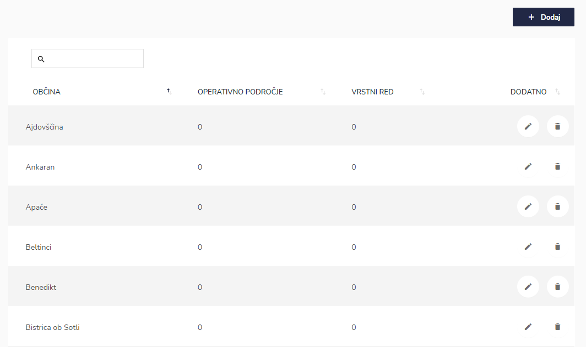
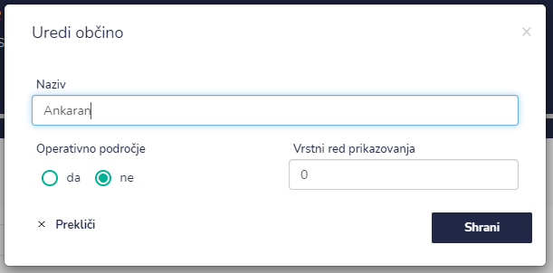
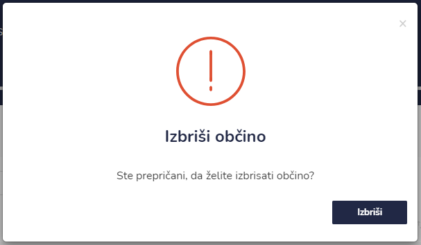

# Občine




| Ime polja                   | Opis polja                                  |
| --------------------------- | ------------------------------------------- |
| **Naziv**                   | Napišite naziv občine.                      |
| **Operativno področje**     | Označite ali je občina operativno področje. |
| **Vrstni red prikazovanja** |                                             |







