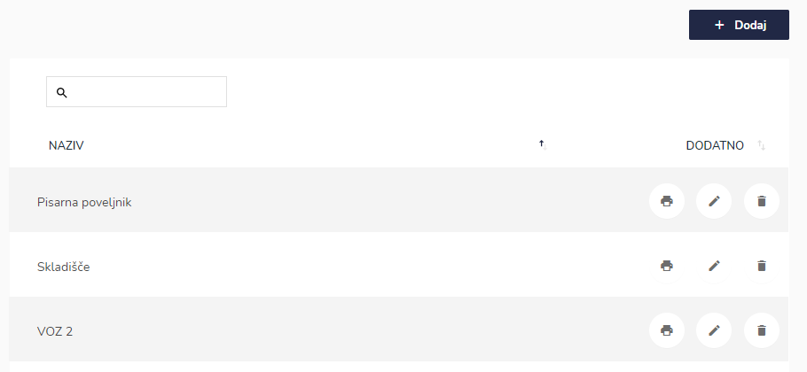
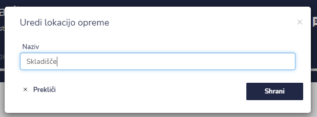
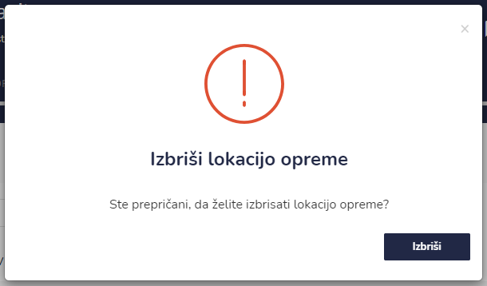
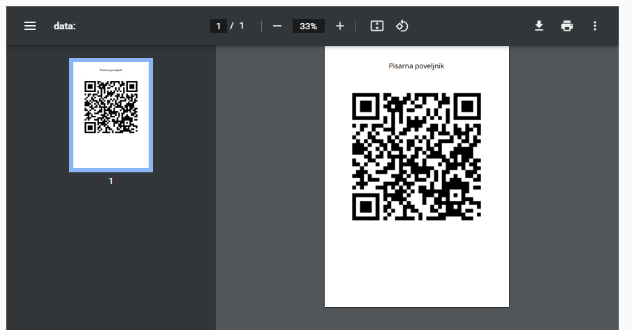

# Lokacije




| Ime polja | Opis polja                    |
| --------- | ----------------------------- |
| **Naziv** | Napišite ime lokacije opreme. |








S klikom na ikono **Prikaži QR** se generira pdf zapis z QR kodo




