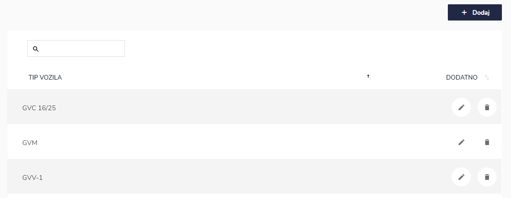
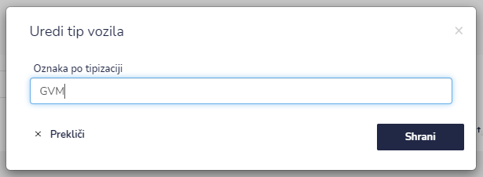
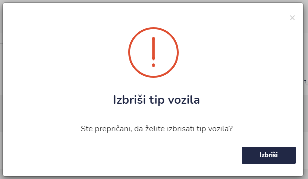

# Tip vozil




| Ime polja                | Opis polja                            |
| ------------------------ | ------------------------------------- |
| **Oznaka po tipizaciji** | Napišite oznako vozila po tipizaciji. |







