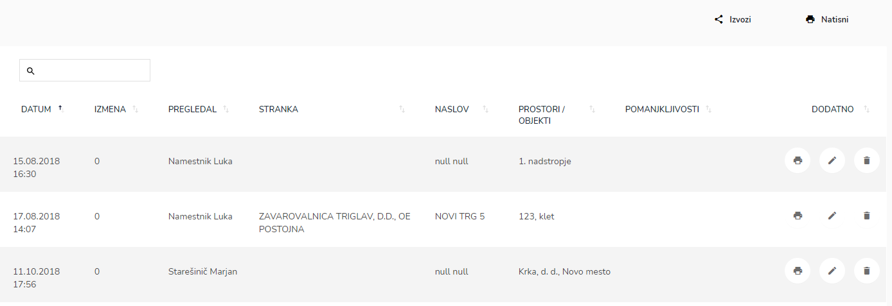
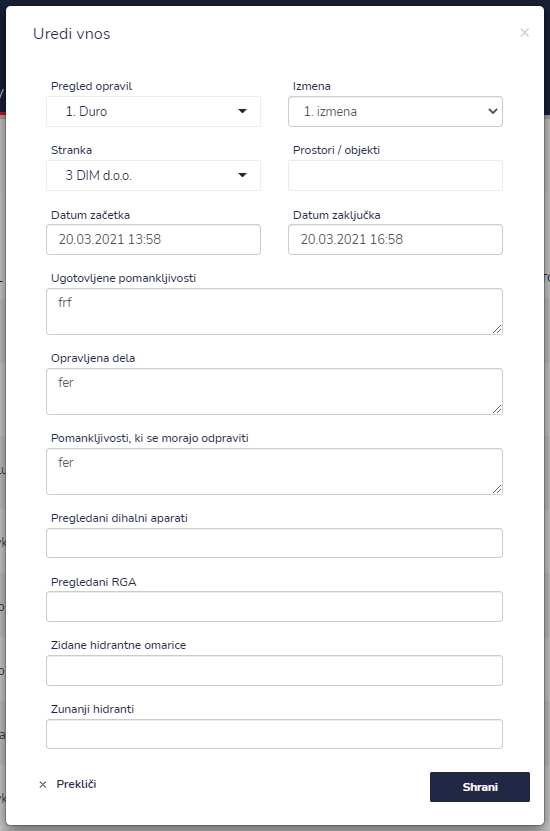
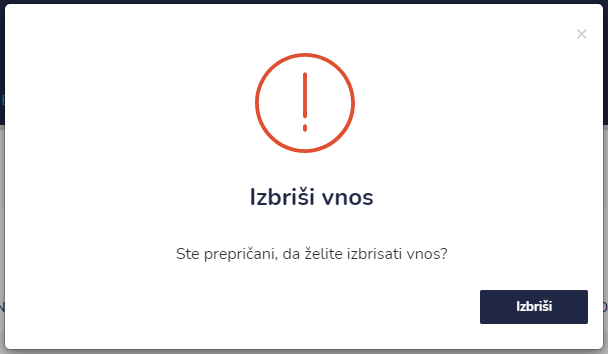
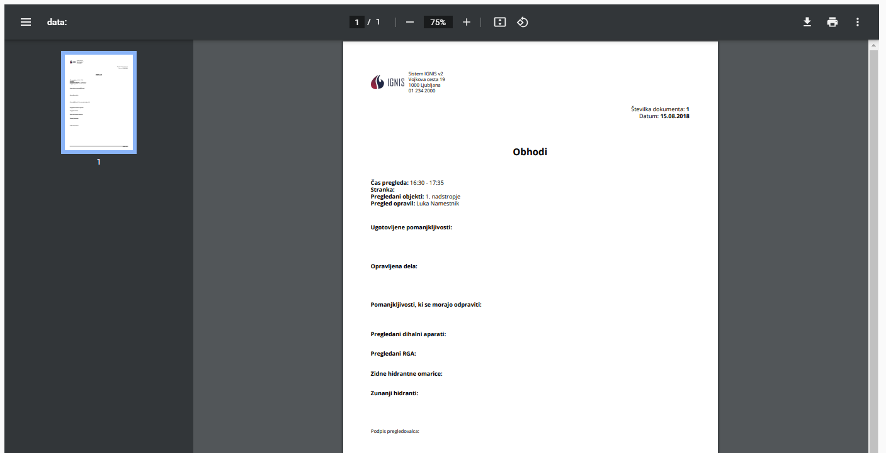

# Arhiv obhodov


[uporaba-tabel-iskanje-sortiranje-izvozi-tiskanje.md](../ostalo/uporaba-tabel-iskanje-sortiranje-izvozi-tiskanje.md)





| Ime polja                                   | Opis polja                                                                      |
| ------------------------------------------- | ------------------------------------------------------------------------------- |
| **Pregled opravil**                         | Iz spustnega seznama izberite zaposlenega.                                      |
| **Izmena**                                  | Iz spustnega seznama izberite izmeno.                                           |
| **Stranka**                                 | S pomočjo spustnega seznama izberite stranko.                                   |
| **Prostor/objekti**                         | Vpišite prostor/objekt kjer se bo izvedel napovedan obhod.                      |
| **Datum začetka**                           | S pomočjo spustnega koledarja izberite dan in uro začetka.                      |
| **Datum zaključka**                         | S pomočjo spustnega koledarja izberite dan in uro zaključka.                    |
| **Ugotovljene pomankljivosti**              | Napišite ali ste ugotovili kakšne pomankljivosti na obhodu.                     |
| **Pomanjkljivosti, ki se morajo odpraviti** | Napišite ali so našli kakšne pomankljivosti, katere bi bilo potrebno odpraviti. |
| **Pregledani dihalni aparati**              | Napišite ali so bili pregledani dihalni aparati.                                |
| **Pregledani RGA**                          | Napišite ali so bili pregledani RGA - ročni gasilni aparati.                    |
| **Zidane hidrantne omarice**                | Napišite ali so bile pregledane zadane hidrantne omarice.                       |
| **Zunanji hidranti**                        | Napišite ali so bili pregledani zunanji hidranti.                               |











