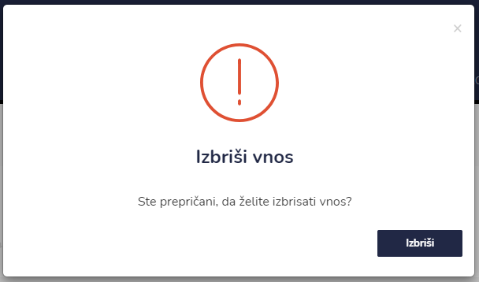
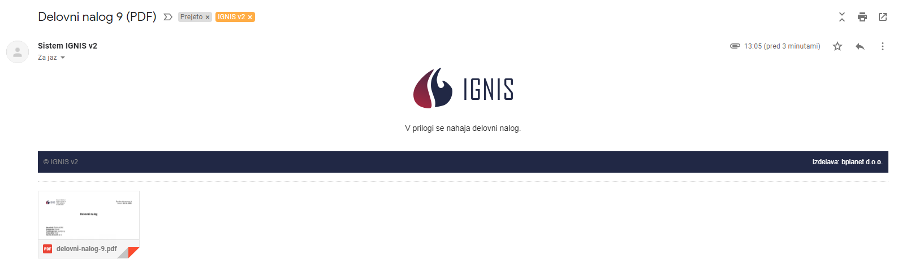

# Delovni nalogi

Tu dostopate do seznama delovnih nalogov.


[uporaba-tabel-iskanje-sortiranje-izvozi-tiskanje.md](../ostalo/uporaba-tabel-iskanje-sortiranje-izvozi-tiskanje.md)





| Ime polja         | Opis polja                                                                                                                                |
| ----------------- | ----------------------------------------------------------------------------------------------------------------------------------------- |
| **Stranka**       | S pomočjo spustnega seznama izberite stranko.                                                                                             |
| **Delovne ure**   | Zapišite število delovnih ur.                                                                                                             |
| **Kategorija**    | S pomočjo spustnega seznama izberite kategorijo delovnega naloga. Na voljo imate: objekt, vozila, oprema in razno.                        |
| **Podkategorija** | S pomočjo spustnega seznama lahko izberete še podkategorijo. Na primer če izberete kategorijo vozilo, pri podkategoriji  izbirate vozilo. |
| **Vrsta dela**    | Napišite vrato dela za katerega se izdaja delovni nalog.                                                                                  |
| **Opis**          | Napišite še opis delovnih nalog pri delovnem nalogu.                                                                                      |
| **Opombe**        | Dopišite še opombe.                                                                                                                       |
| **Delo opravil**  | S pomočjo spustnega seznama poiščite zaposlenega.                                                                                         |
| **Datum**         | S pomočjo spustnega koledarja izberite datum izposoje.                                                                                    |
| **Delo odobril**  | S pomočjo spustnega seznama dodajte kdo je odobril delovni nalog                                                                          |







Če želite izvesti elektronski podpis, lahko to storite s klikom na ikono **Podpis stranke**,&#x20;

kjer se odpre okno za Podpis stranke

.PNG>)

prejemnik se podpiše v okno

s klikom na **POTRDI** se podpis shrani.&#x20;

Če je posamezen delovni nalog že podpisan s strani stranke, to lahko vidite, ker ikone za podpis ni več na voljo.






Delovni nalog lahko pošljete tudi po elektronski pošti.





S pomočjo spustnega seznama izberite uporabljene materiale oz. opravljene storitve. Napišite količino ter s klikom na **Dodaj** dodate nov vnos **materiala / opravljene storitve**.

Za izbris posamezne postavke kliknite na **X** pred posamezno vrstico.

S klikom na **Zapri** se vrnete na začetni pogled Delovnih nalogov.



## Pošiljanje delovnega naloga po elektronski pošti

S klikom na **Pošlji na email**  se odpre okno **Pošlji poročilo (PDF)**

s pomočjo spustnega seznama izberite stranko ali zaposlenega, kateremu boste poslali delovni nalog.

V elektronski nabiralnik bo prejenik prejel email z izbranim delovnim nalogom​ (nalog je v priponki maila).‌

### &#x20;
