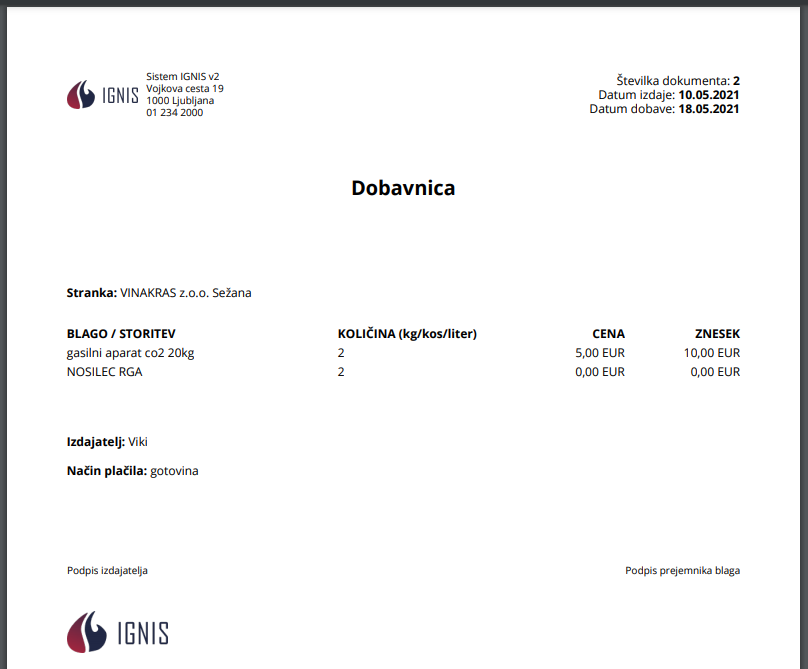

# Dobavnice


[uporaba-tabel-iskanje-sortiranje-izvozi-tiskanje.md](../ostalo/uporaba-tabel-iskanje-sortiranje-izvozi-tiskanje.md)





| Ime polja         | Opis polja                                                 |
| ----------------- | ---------------------------------------------------------- |
| **Stranka**       | S pomočjo spustnega seznama izberite stranko.              |
| **Datum izdaje**  | S pomočjo spustnega koledarja izberite datum izdaje.       |
| **Datum dobave**  | S pomočjo spustnega koledarja izberite datum dobave.       |
| **Izdajatelj**    | Iz spustenga seznama izberite kdo je izdajatelj dobavnice. |
| **Način plačila** | Označite način plačila. Na voljo imate: TRR ali gotovina.  |







Če želite izvesti elektronski podpis, lahko to storite s klikom na **''Podpis prejemnika blaga''**,

kjer se odpre okno za Podpis prejemnika blaga

prejemnik se podpiše v okno

s klikom na **POTRDI** se podpis shrani.&#x20;

Če je posamezena dobavnica že podpisan s strani prejemnika blaga, to lahko vidite, ker ikone za podpis ni več na voljo.





S pomočjo spustnega seznama izberite uporabljene materiale oz. opravljene storitve.&#x20;

Napišite količino ter s klikom na **Dodaj** dodate nov vnos **blaga**.

.PNG>)

Za izbris posamezne postavke kliknite na **X** pred posamezno vrstico.

S klikom na **Zapri** se vrnete na začetni pogled Dobavnica.







​‌
