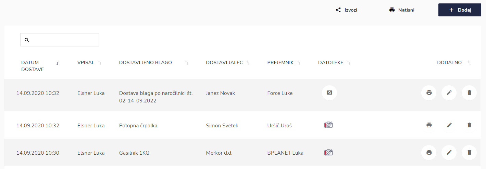
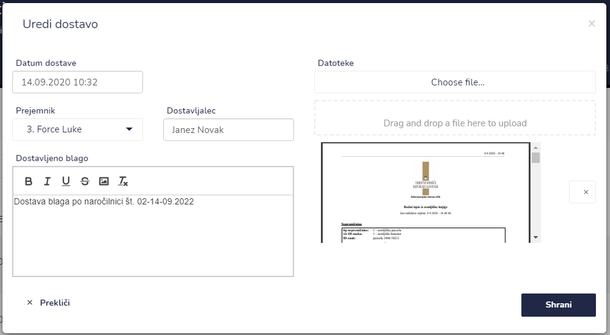
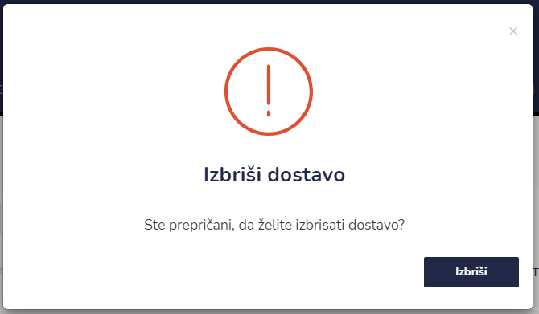
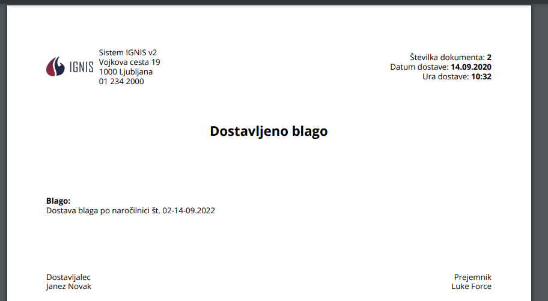

# Dostavljeno blago


[uporaba-tabel-iskanje-sortiranje-izvozi-tiskanje.md](../ostalo/uporaba-tabel-iskanje-sortiranje-izvozi-tiskanje.md)





| Ime polja             | Opis polja                                                                         |
| --------------------- | ---------------------------------------------------------------------------------- |
| **Datum**             | S pomočjo spustnega koledarja izberite datum in uro dostave blaga.                 |
| **Prejemnik**         | Vpišite prejemnika s pomočjo spustnega seznama.                                    |
| **Dostavljalec**      | Vpišite ime dostavljalca.                                                          |
| **Dostavljeno blago** | Napišite ime in številko dokumenta po katerem se opravlja dostava blaga.           |
| **Datoteka**          | Tu lahko dodate še dodatene datoteke oz. dokumente, kateri so pomembni za dostavo. |











​

