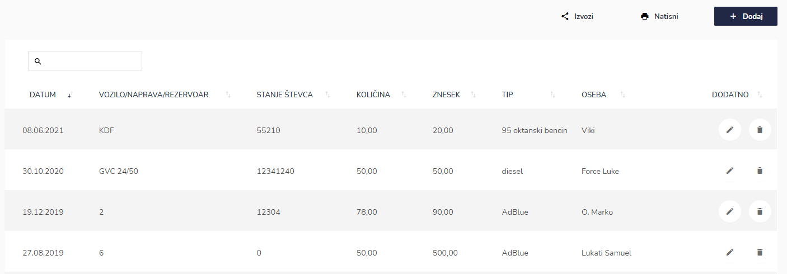
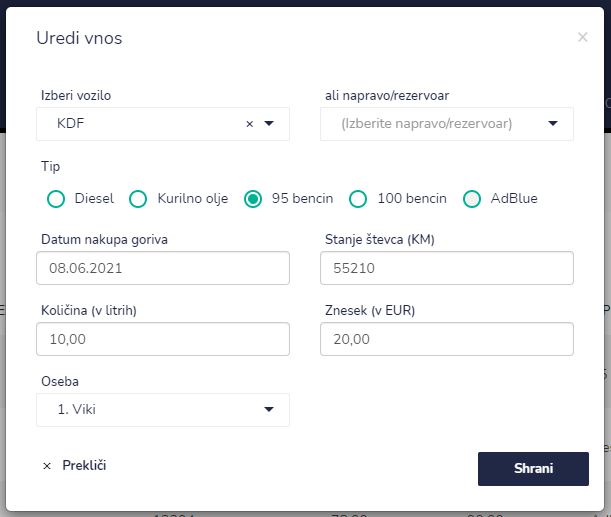
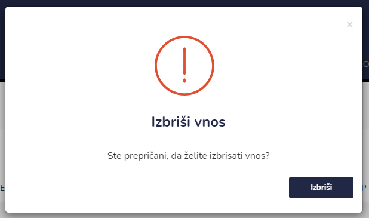

# Gorivo


[uporaba-tabel-iskanje-sortiranje-izvozi-tiskanje.md](../ostalo/uporaba-tabel-iskanje-sortiranje-izvozi-tiskanje.md)





| Ime polja                 | Opis polja                                                  |
| ------------------------- | ----------------------------------------------------------- |
| **Izberi vozilo**         | S pomočjo spustnega seznama izberite vozilo.                |
| **ali napravo/rezervoar** | S pomočjo spustnega izberite naprav oz. rezervoar.          |
| **Datum nakupa goriva**   | S pomočjo spustnega koledarja izberite datum nakupa goriva. |
| **Stanje števca (KM)**    | Vpišite stanje števca v kilometrih.                         |
| **Količina (v litrih)**   | Vpišite količino goriva v litrih.                           |
| **Znesek (v EUR)**        | Napišite še znesek nakupljenega goriva v evrih.             |
| **Oseba**                 | Iz spustenga seznama izberite uporabnika oz. zaposlenega.   |







