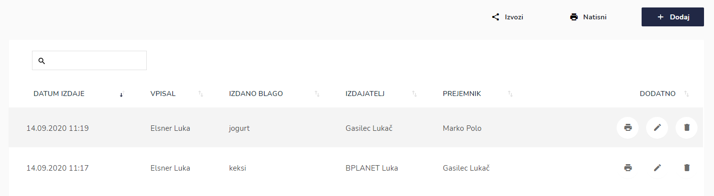
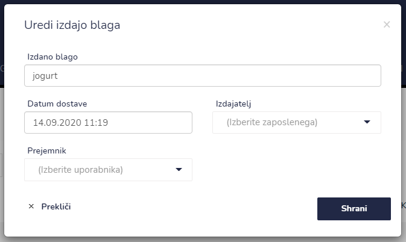
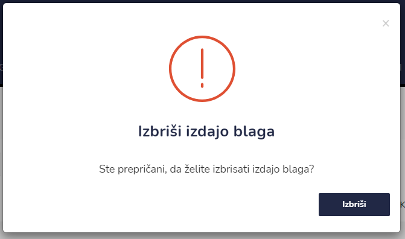
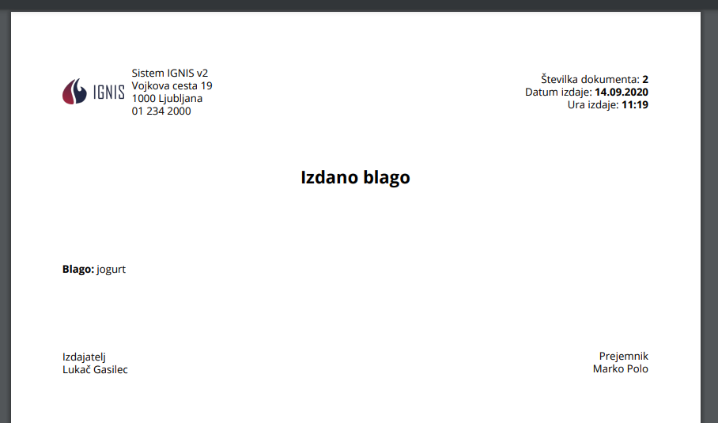

# Izdano blago


[uporaba-tabel-iskanje-sortiranje-izvozi-tiskanje.md](../ostalo/uporaba-tabel-iskanje-sortiranje-izvozi-tiskanje.md)





| Ime polja         | Opis polja                                                         |
| ----------------- | ------------------------------------------------------------------ |
| **Izdano blago**  | Napišite kakšno blago se izdaja.                                   |
| **Datum dostave** | S pomočjo spustnega koledarja izberite datum in uro dostave blaga. |
| **Izdajatelj**    | Iz spustenga seznama izberite izdaljatelja blaga.                  |
| **Prejemnik**     | Iz spustenga seznama izberite prejemnika blaga.                    |











​‌

